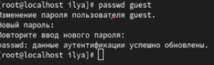
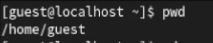
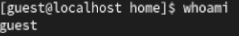
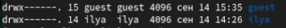
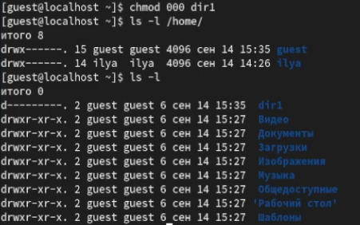
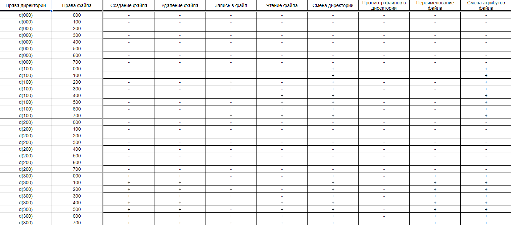
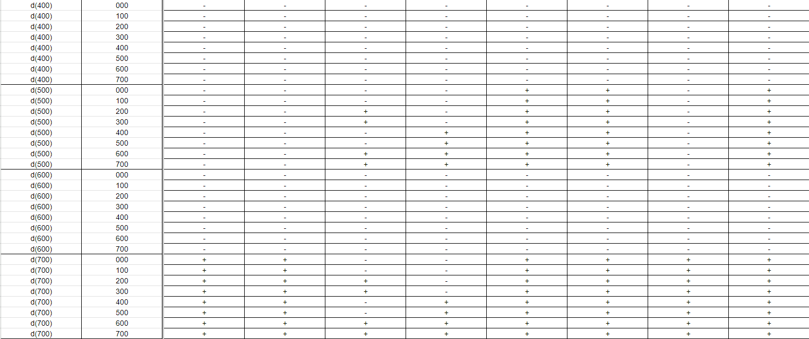
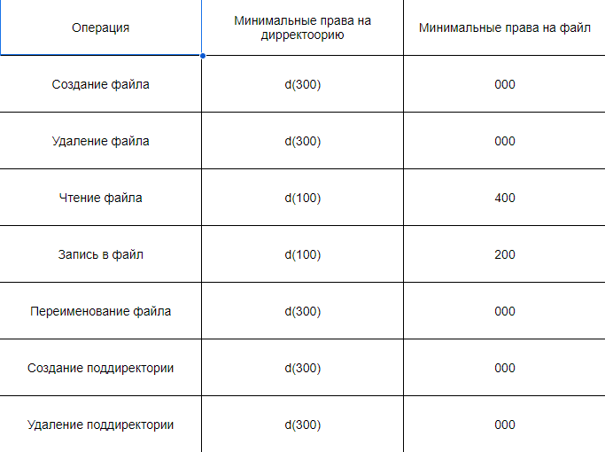

---
## Front matter
lang: ru-RU
title: Презентация к лабораторной работе №1
subtitle: Информационная безопасность
author:
  - Ким И. В. НФИбд-01-21
institute:
  - Российский университет дружбы народов, Москва, Россия

## i18n babel
babel-lang: russian
babel-otherlangs: english

## Formatting pdf
toc: false
toc-title: Содержание
slide_level: 2
aspectratio: 169
section-titles: true
theme: metropolis
header-includes:
 - \metroset{progressbar=frametitle,sectionpage=progressbar,numbering=fraction}
---

## Цели и задачи

- Получение практических навыков работы в консоли с атрибутами файлов, закрепление теоретических основ дискреционного разграничения доступа в современных системах с открытым кодом на базе ОС Linux.

## Выполнение работы

- Добавил гостевую учетную запись | команда: useradd guest 
- Задал пароль для пользователя | команда: passwd guest 

## Выполнение работы

- Вошел в систему от имени пользователя guest
- Проверил в какой директории нахожусь и убедился, что это домашняя директория | команда: pwd

## Выполнение работы

- Уточнил имя пользователя | команда: whoami

## Выполнение работы

- Нашел свою учетную запись в файле | команда: cat /etc/passwd
- Определил существующие в системе директории | команда: ls -l /home/

## Выполнение работы

- Создал в домашней директории поддиректорию | команда: mkdir dir1
- Снял с директории dir1 все атрибуты | команда: chmod 000 dir1
- Проверил ее правильность | команда: ls -l

## Выполнение работы

- Заполнил таблицу меняя права доступа на директрорию и файл (000-700) 

## Выполнение работы

- Заполнил таблицу минимальных прав доступа

## Выводы

Получил практические навыки работы в консоли с атрибутами файлов, закрепил теоретические основы дискреционного разграничения доступа в современных системах с открытым кодом на базе ОС Linux.
 

