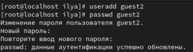
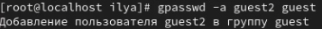
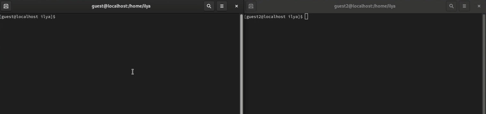
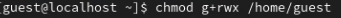
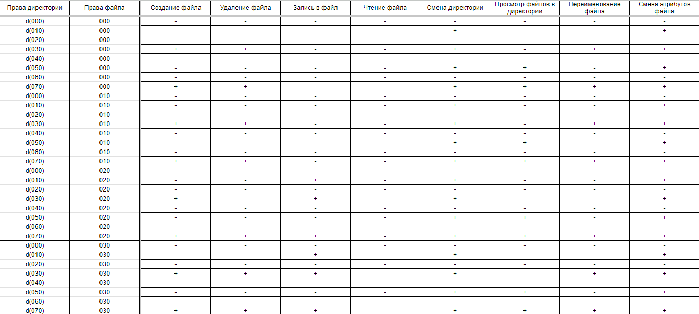
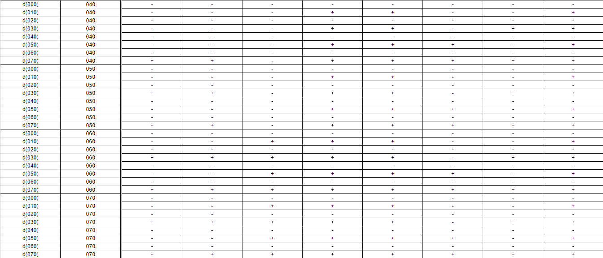
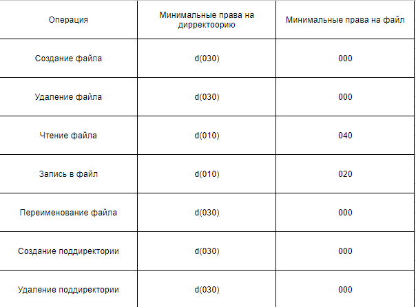

---
## Front matter
lang: ru-RU
title: Презентация к лабораторной работе №3
subtitle: Информационная безопасность
author:
  - Ким И. В. НФИбд-01-21
institute:
  - Российский университет дружбы народов, Москва, Россия

## i18n babel
babel-lang: russian
babel-otherlangs: english

## Formatting pdf
toc: false
toc-title: Содержание
slide_level: 2
aspectratio: 169
section-titles: true
theme: metropolis
header-includes:
 - \metroset{progressbar=frametitle,sectionpage=progressbar,numbering=fraction}
---

## Цели и задачи

- Получение практических навыков работы в консоли с атрибутами файлов для групп пользователей

## Выполнение работы

- Добавил гостевую учетную запись guest2 и задал пароль | useradd guest | passwd guest

## Выполнение работы

- Добавил пользователя guest2 в группу guest | gpasswd -a guest2 guest

## Выполнение работы

- Осуществил вход от двух пользователей ( guest и guest2 ) на двух разных консолях 

## Выполнение работы

- От имени пользователя guest2 выполнил регистрацию пользователя guest2 в группe guest | newgrp guest

## Выполнение работы

- От имени пользователя guest изменил права директории /home/guest, разрешив все действия для пользователей группы | chmod g+rwx /home/guest

## Выполнение работы

- От имени пользователя guest снял с директории /home/guest/dir1 все атрибуты | chmod 000 dirl

## Выполнение работы

- Меняя атрибуты директории и файла от имени пользователя guest, заполнил таблицу прав доступа и минимальных прав доступа

## Выполнение работы

## Выполнение работы

## Выводы

- Полученил практические навыки работы в консоли с атрибутами файлов для групп пользователей

