---
## Front matter
lang: ru-RU
title: Презентация к лабораторной работе №4 
subtitle: Дискреционное разграничение прав в Linux. Расширенные атрибуты
author:
  - Ким И. В. НФИбд-01-21
institute:
  - Российский университет дружбы народов, Москва, Россия

## i18n babel
babel-lang: russian
babel-otherlangs: english

## Formatting pdf
toc: false
toc-title: Содержание
slide_level: 2
aspectratio: 169
section-titles: true
theme: metropolis
header-includes:
 - \metroset{progressbar=frametitle,sectionpage=progressbar,numbering=fraction}
---

# Цели и задачи

Получение практических навыков работы в консоли с расширенными атрибутами файлов
 
# Выполнение работы

## Зашел с двух консолей от имени пользователя guest и суперпользователя

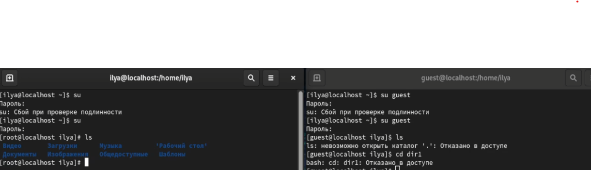{#fig:001 width=70%}

## От имени пользователя guest определил расширенные атрибуты файла "file1"

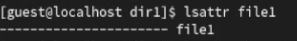{#fig:002 width=70%}

## Установил права на файл "file1" разрешающие запись и чтение для владельца файла

{#fig:003 width=70%}

## Попробовал установить на файл расширенный атрибут "a", получил отказ в доступе

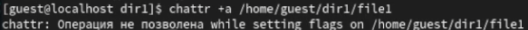{#fig:004 width=70%}

## Установил на файл расширенный атрибут от имени суперпользователя

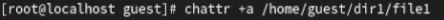{#fig:005 width=70%}

## От пользователя guest проверил правильность установленных атрибутов

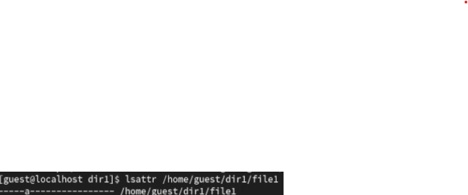{#fig:006 width=70%}

## От имени пользователя guest попробовал выполнить запись, чтение, переименование и удаление файла "file1", получил отказ.

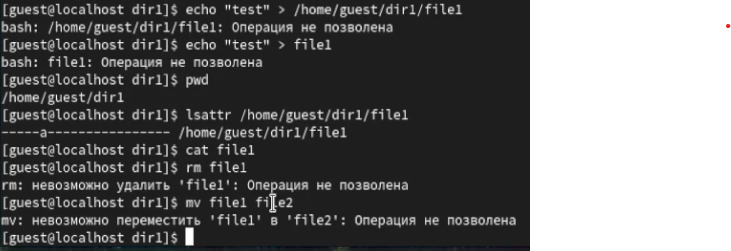{#fig:007 width=70%}

## Попробовал поменять права файла на "000" от обоих пользователей, получил отказ

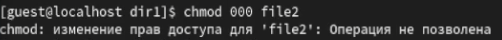{#fig:008 width=70%}

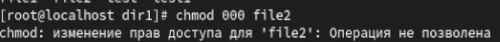{#fig:009 width=70%}

## Снял расширенный атрибут "a" с файла, попробовал выполнить команды еще раз. Запись, чтение, переименование и удаление можно сделать. 

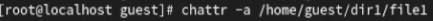{#fig:010 width=70%}

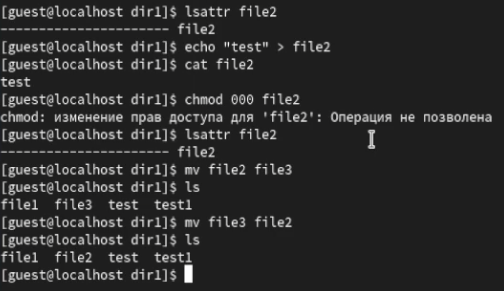{#fig:011 width=70%}

## Попробовал поменять права на "000", получил отказ.

## Повторил все действия с расширенным атрибутом "i". Запись, переименование и смена прав были запрещены, а чтение - разрешено.

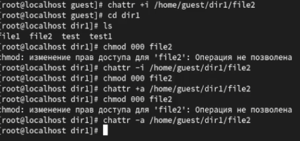{#fig:012 width=70%}

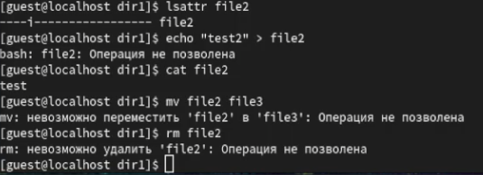{#fig:013 width=70%}

## Составил таблицу прав действий с расширенными атрибутами "a" и "i".

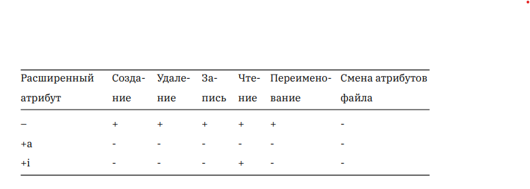{#fig:014 width=70%}

## Выводы

Повысил свои навыки использование интерфейса командной строки, познакомился на примерах с тем, как используются основные и расширенные атрибуты
при разграничении доступа. Составил наглядные таблицы, поясняющие какие операции возможны при тех или иных установленных правах. Опрробовал 
действие на практике расширенных атрибутов "a" и "i".

