---
## Front matter
lang: ru-RU
title: Презентация к лабораторной работе №5 
subtitle: Дискреционное разграничение прав в Linux. Исследование влияния дополнительных атрибутов
author:
  - Ким И. В. НФИбд-01-21
institute:
  - Российский университет дружбы народов, Москва, Россия

## i18n babel
babel-lang: russian
babel-otherlangs: english

## Formatting pdf
toc: false
toc-title: Содержание
slide_level: 2
aspectratio: 169
section-titles: true
theme: metropolis
header-includes:
 - \metroset{progressbar=frametitle,sectionpage=progressbar,numbering=fraction}
---

# Цели и задачи

Изучение механизмов изменения идентификаторов, применения
SetUID- и Sticky-битов. Получение практических навыков работы в консоли с дополнительными атрибутами. Рассмотрение работы механизма
смены идентификатора процессов пользователей, а также влияние бита
Sticky на запись и удаление файлов

# Выполнение лабораторной работы

# Создание программы

## Создал программу simpleid.c 

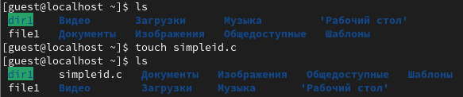{#fig:001 width=70%}

## Записал код программы в simpleid.c 

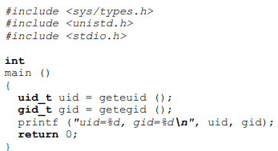{#fig:002 width=70%}

## Скомпилировал и выполнил программу simpleid.c 

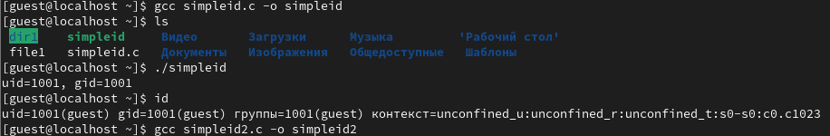{#fig:003 width=70%}

## Изменил код программы в simpleid.c 

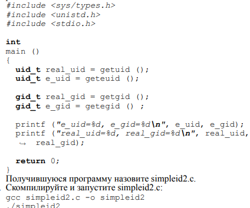{#fig:004 width=70%}

## Скомпилировал и выполнил программу simpleid2.c 

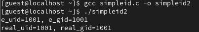{#fig:005 width=70%}

## От имени суперпользователя поменял права на файл simpleid2.c, поменял владельца файла и выполнил программу 

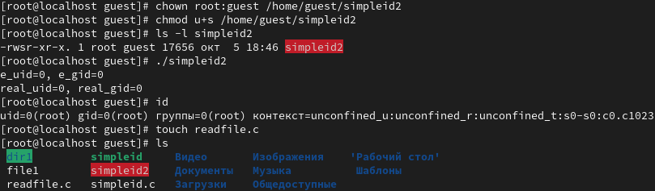{#fig:006 width=70%}

 - Результаты выполнения отличаются.

## Создал файл readfile.c 

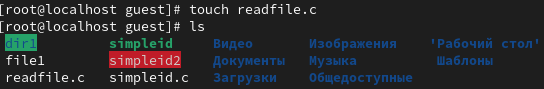{#fig:007 width=70%}
 
## Записал код программы в readfile.c 

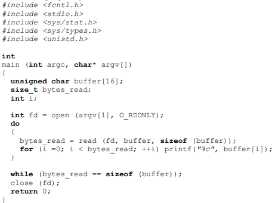{#fig:008 width=70%}

## Скомпилировал readfile.c 

{#fig:009 width=70%}

## Сменил права и владельца readfile.c, попрбовал от имени пользователя guest прочитать файл, получил отказ 

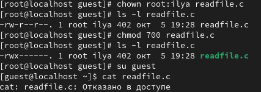{#fig:010 width=70%}

## С помощью программы readfile прочитал файл /etc/shadow 

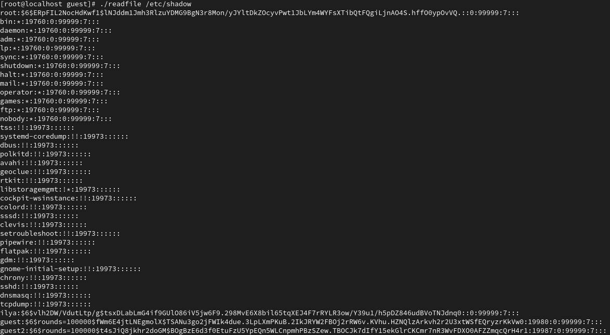{#fig:011 width=70%}

# Исследование Sticky-бита

## Проверил установлен ли атрибут Sticky на директории /tmp , создал в ней файл file91.txt

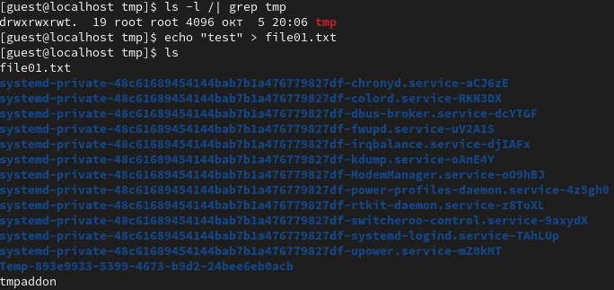{#fig:012 width=70%}

## Проверил атрибуты у файла file01.txt , поменял атрибуты на чтение и запись для остальных пользователей 

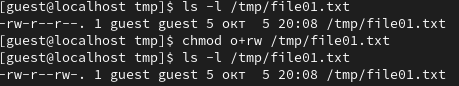{#fig:013 width=70%}

## От пользователя guest 2 попробовал прочитать, изменить и удалить file01.txt, получилось только прочитать   

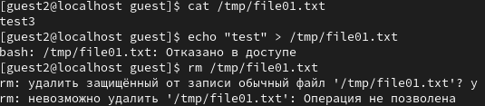{#fig:014 width=70%}

## От имени суперпользователя снял атрибут t у /tmp 

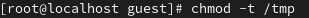{#fig:015 width=70%}

## От имени guest 2 проверил, что у директории /tmp нет атрибута t. Попробовал сделать команды еще раз, ничего не поменялось. 

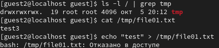{#fig:016 width=70%}

## Поменял права файла file01.txt на 666 

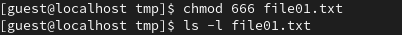{#fig:017 width=70%}

## Попробовал выполнить команды еще раз, получилось сделать все, кроме удаления

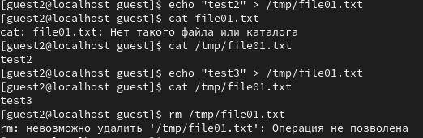{#fig:018 width=70%}

## Удалил атрибут t и выполнил команды, получилось выполнить все, включая удаление 

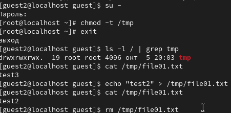{#fig:019 width=70%}

# Выводы

Повысил свои навыки использование интерфейса командной строки, познакомился на примерах с тем, как используются основные и расширенные атрибуты
при разграничении доступа. Составил наглядные таблицы, поясняющие какие операции возможны при тех или иных установленных правах. Опрробовал 
действие на практике расширенных атрибутов "a" и "i".

