---
## Front matter
lang: ru-RU
title: Презентация к лабораторной работе №6 
subtitle: Мандатное разграничение прав в Linux
author:
  - Ким И. В. НФИбд-01-21
institute:
  - Российский университет дружбы народов, Москва, Россия

## i18n babel
babel-lang: russian
babel-otherlangs: english

## Formatting pdf
toc: false
toc-title: Содержание
slide_level: 2
aspectratio: 169
section-titles: true
theme: metropolis
header-includes:
 - \metroset{progressbar=frametitle,sectionpage=progressbar,numbering=fraction}
---

# Цели и задачи

Развить навыки администрирования ОС Linux. Получить первое практическое знакомство с технологией SELinux1.
Проверить работу SELinx на практике совместно с веб-сервером Apache.

# Выполнение лабораторной работы

## Установил httpd на CentOS 

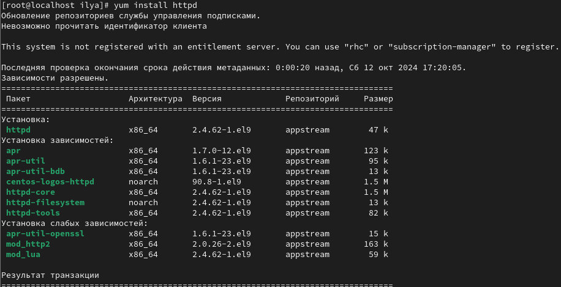{#fig:001 width=70%}

## В конфигурационном файле httpd.conf задал параметр ServerName 

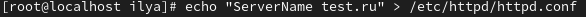{#fig:002 width=70%}

## Добавил разрешающие правила 

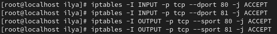{#fig:003 width=70%}

## Проверил режим и политику работы системы 

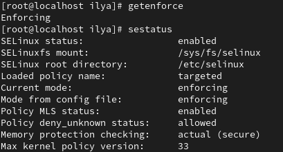{#fig:004 width=70%}

## Запустил сервер apache (рис. [-@fig:005])

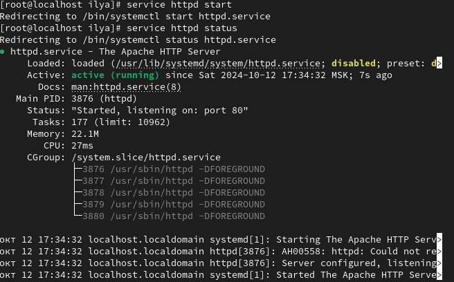{#fig:005 width=70%}

## Определил контекст безопасности Apache 

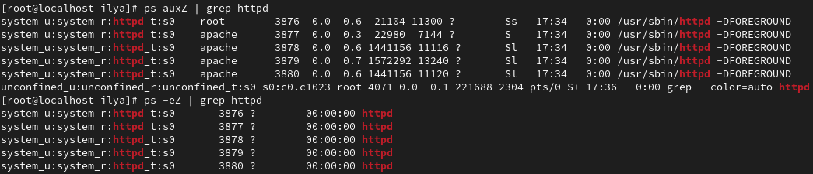{#fig:006 width=70%}

## Посмотрел текущее состояние переключателей SELinux для Apache

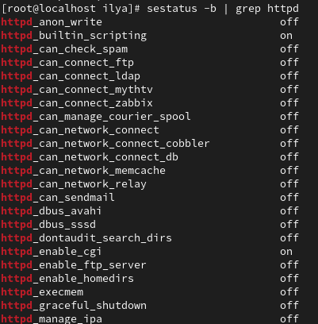{#fig:007 width=70%}

## Установил пакет "settools-console"  

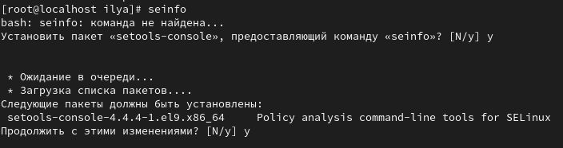{#fig:008 width=70%}

## Посмотрел статистику по политике 

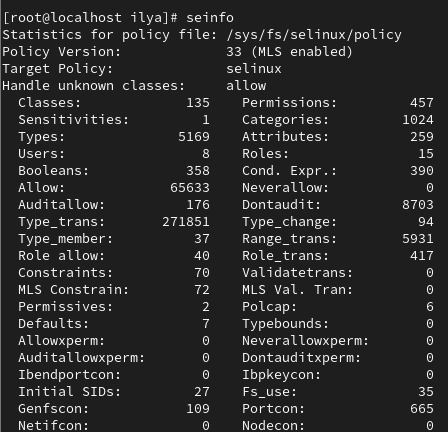{#fig:009 width=70%}

## Посмотрел тип файлов и поддиректорий 

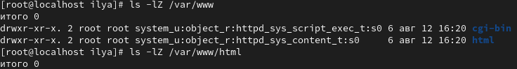{#fig:010 width=70%}

## Создал html файл от имени суперпользователя 

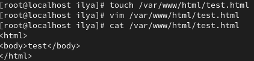{#fig:011 width=70%}

## Проверил контекст созданного файла 

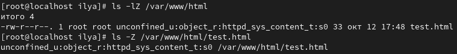{#fig:012 width=70%}

## Открыл в браузере наш файл 

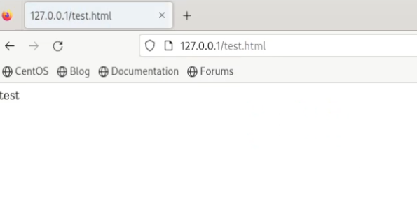{#fig:013 width=70%}

## Изменил контекст файла test.html  

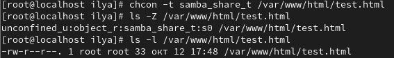{#fig:014 width=70%}

## Попробовал открыть в браузере наш файл, получил ошибку

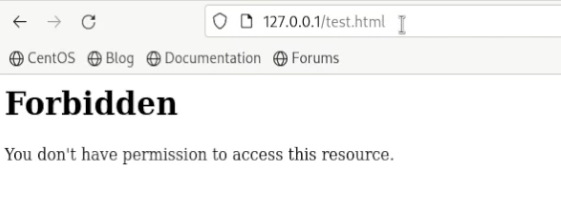{#fig:015 width=70%}

## В файле httpd.conf изменил Listen с 80 на 81

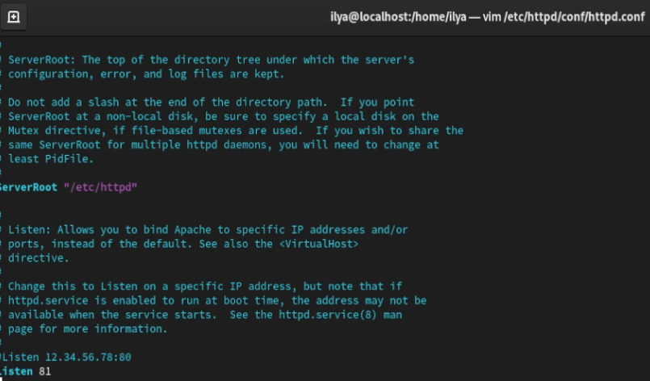{#fig:016 width=70%}

## Сделал перезапуск Apache, произошел сбой 

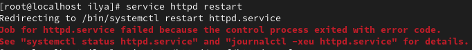{#fig:017 width=70%}

## Добавил 81 порт в список

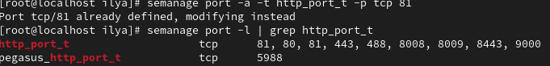{#fig:018 width=70%}

## Добавил 81 порт в список, также изменил test.html 

{#fig:019 width=70%}

## Открыл файл в браузере 

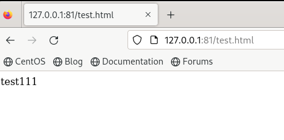{#fig:020 width=70%}

## Вернул контекст файлу test.html

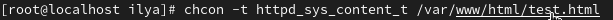{#fig:021 width=70%}

## Вернул Listen 80 в файл html.config

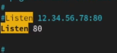{#fig:021 width=70%}

## Удалил привязку к 81 порту 

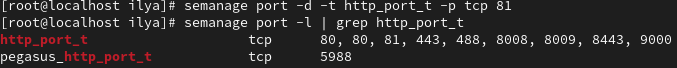{#fig:022 width=70%}

## Удалил файл test.html

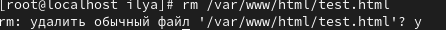{#fig:023 width=70%}

# Выводы

Развил навыки администрирования ОС Linux. Получил первое практическое знакомство с технологией SELinux. Проверил работу SELinux на практике совместно с веб-сервером Apache.

