---
## Front matter
lang: ru-RU
title: Презентация к лабораторной работе №7 
subtitle: Элементы криптографии. Однократное гаммирование
author:
  - Ким И. В. НФИбд-01-21
institute:
  - Российский университет дружбы народов, Москва, Россия

## i18n babel
babel-lang: russian
babel-otherlangs: english

## Formatting pdf
toc: false
toc-title: Содержание
slide_level: 2
aspectratio: 169
section-titles: true
theme: metropolis
header-includes:
 - \metroset{progressbar=frametitle,sectionpage=progressbar,numbering=fraction}
---

# Цели и задачи

Освоить на практике применение режима однократного гаммирования

# Выполнение лабораторной работы

## Подключил библиотеки и ввел сообщение "С Новым Годом, друзья!" 

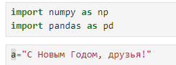{#fig:001 width=70%}

## Перевод сообщения в шестнадцатеричную систему счисления 

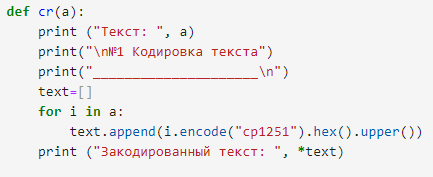{#fig:002 width=70%}

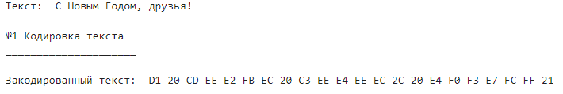{#fig:003 width=70%}

## Создание ключа

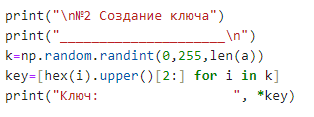{#fig:004 width=70%}

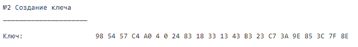{#fig:005 width=70%}

## Кодировка текста ключем 

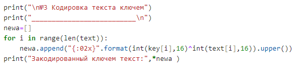{#fig:006 width=70%}

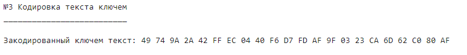{#fig:007 width=70%}

## Создание нового ключа

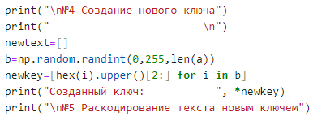{#fig:008 width=70%}

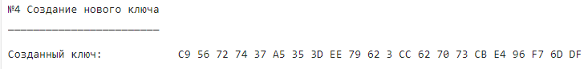{#fig:009 width=70%}

## Раскодировка текста новым ключем

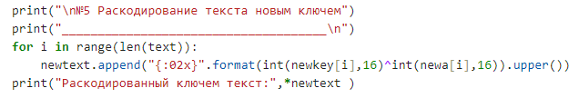{#fig:010 width=70%}

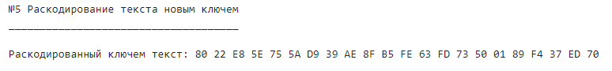{#fig:011 width=70%}

## Полученный текст 

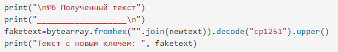{#fig:012 width=70%}

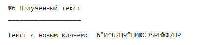{#fig:013 width=70%}

## Поиск нужного ключа по исходному и закодированному тексту

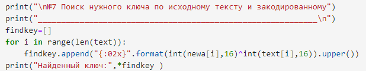{#fig:014 width=70%}

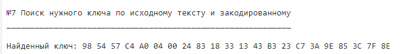{#fig:015 width=70%}

## Расшифровка текста по найденному ключу

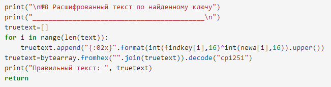{#fig:016 width=70%}

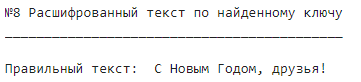{#fig:017 width=70%}

# Выводы

Освоил на практике применение однократного гаммирования

