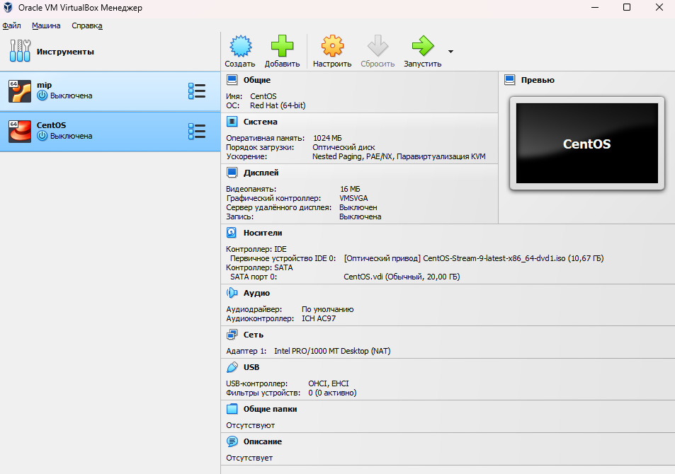
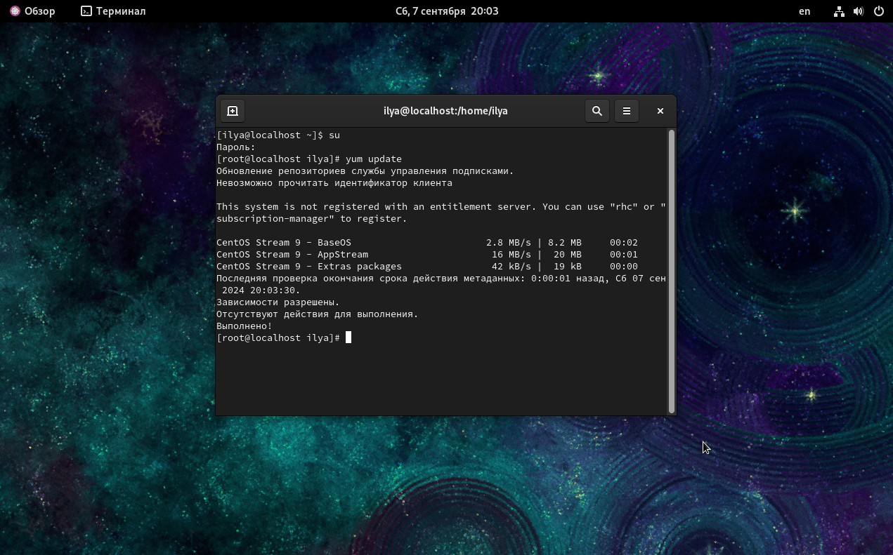

---
## Front matter
title: "Laboratory work"
subtitle: "information security"
author: "Kim Ilya Vladislavovich"

## Generic otions
lang: eng-ENG
toc-title: "Soderzhanie"

## I18n polyglossia
polyglossia-lang:
  name: russian
  options:
	- spelling=modern
	- babelshorthands=true
polyglossia-otherlangs:
  name: english
  ## I18n babel
babel-lang: russian
babel-otherlangs: english
## Fonts
mainfont: IBM Plex Serif
romanfont: IBM Plex Serif
sansfont: IBM Plex Sans
monofont: IBM Plex Mono
mathfont: STIX Two Math
mainfontoptions: Ligatures=Common,Ligatures=TeX,Scale=0.94
romanfontoptions: Ligatures=Common,Ligatures=TeX,Scale=0.94
sansfontoptions: Ligatures=Common,Ligatures=TeX,Scale=MatchLowercase,Scale=0.94
monofontoptions: Scale=MatchLowercase,Scale=0.94,FakeStretch=0.9
mathfontoptions:
## Biblatex
biblatex: true
biblio-style: "gost-numeric"
biblatexoptions:
  - parentracker=true
  - backend=biber
  - hyperref=auto
  - language=auto
  - autolang=other*
  - citestyle=gost-numeric
  ## Pandoc-crossref LaTeX customization
figureTitle: "Ris."
tableTitle: "Tablitsa"
listingTitle: "Listing"
lofTitle: "Spisok illustraciy"
lotTitle: "Spisok tablic"
lolTitle: "Listingi"
## Misc options
indent: true
header-includes:
  - \usepackage{indentfirst}
  - \usepackage{float} # keep figures where there are in the text
  - \floatplacement{figure}{H} # keep figures where there are in the text
---

# purpose of work
Acquiring practical skills in installing an operating system on a virtual machine, setting up the minimum services necessary for further operation.

# Execution of work
1. Downloaded the CentOS iso image, launched VirtualBox and created a virtual machine.

2. Logged in as administrator and updated system elements

# Conclusion

Completed the task, installed CentOS on a virtual machine, and updated the system.