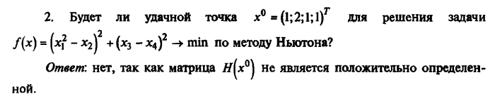
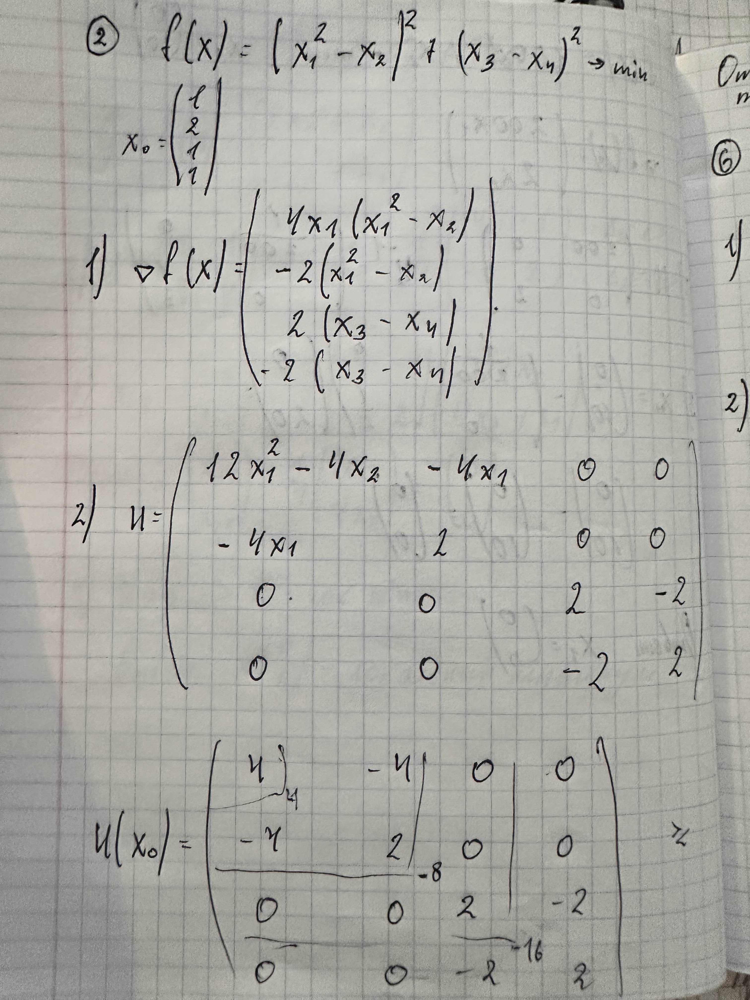
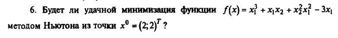
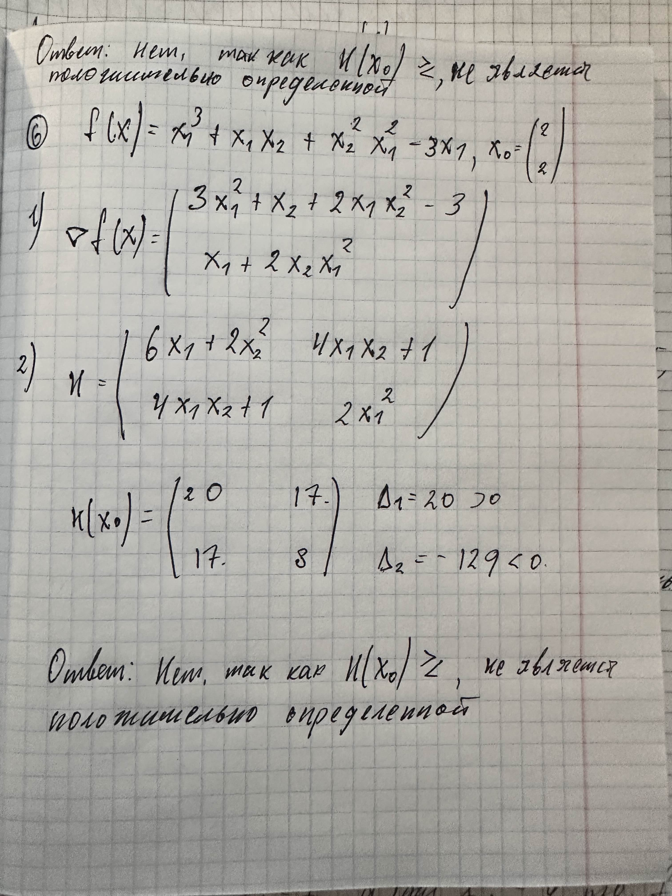
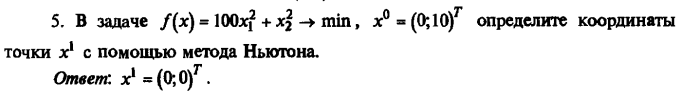
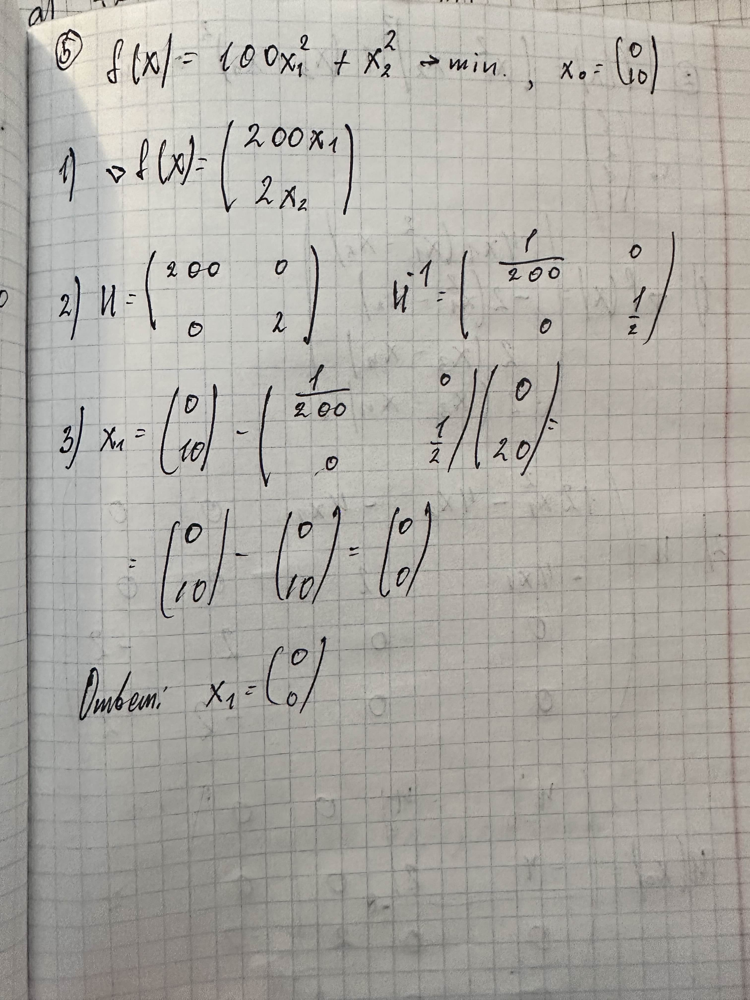
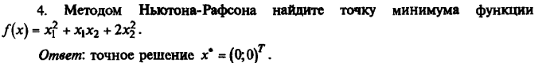

---
## Front matter
title: "Методы оптимизации и исследование операций"
subtitle: "Домашнее задание №3"
author: "Ким Илья Владиславович НФИбд-01-21"

## Generic otions
lang: ru-RU
toc-title: "Содержание"

## Bibliography
bibliography: bib/cite.bib
csl: pandoc/csl/gost-r-7-0-5-2008-numeric.csl

## Pdf output format
toc: true # Table of contents
toc-depth: 2
fontsize: 12pt
linestretch: 1.5
papersize: a4
documentclass: scrreprt
## I18n polyglossia
polyglossia-lang:
  name: russian
  options:
	- spelling=modern
	- babelshorthands=true
polyglossia-otherlangs:
  name: english
## I18n babel
babel-lang: russian
babel-otherlangs: english
## Fonts
mainfont: IBM Plex Serif
romanfont: IBM Plex Serif
sansfont: IBM Plex Sans
monofont: IBM Plex Mono
mathfont: STIX Two Math
mainfontoptions: Ligatures=Common,Ligatures=TeX,Scale=0.94
romanfontoptions: Ligatures=Common,Ligatures=TeX,Scale=0.94
sansfontoptions: Ligatures=Common,Ligatures=TeX,Scale=MatchLowercase,Scale=0.94
monofontoptions: Scale=MatchLowercase,Scale=0.94,FakeStretch=0.9
mathfontoptions:
## Biblatex
biblatex: true
biblio-style: "gost-numeric"
biblatexoptions:
  - parentracker=true
  - backend=biber
  - hyperref=auto
  - language=auto
  - autolang=other*
  - citestyle=gost-numeric
## Pandoc-crossref LaTeX customization
figureTitle: "Рис."
## Misc options
indent: true
header-includes:
  - \usepackage{indentfirst}
  - \usepackage{float} # keep figures where there are in the text
  - \floatplacement{figure}{H} # keep figures where there are in the text
---

# Цель работы

 - Требуется выполнить любые 4 задания из прикрепленного файла. Следует в качестве методов решения использовать методы Ньютона и Ньютона-Рафсона. 

 - При вычислениях можно ограничиться несколькими шагами метода, остальные же выполнить с использованием программных средств. 

 - Необходимо наличие подробного решения. 

 - Файлы загружаются только в формате .pdf.

# Задание №2

{#fig:001 width=70%}

{#fig:002 width=60%}

{#fig:003 width=70%}

# Задание №6

{#fig:004 width=70%}

{#fig:005 width=70%}

# Задание №5

{#fig:006 width=70%}

{#fig:007 width=70%}

# Задание №4

{#fig:008 width=70%}

{#fig:009 width=70%}