---
## Front matter
title: "Информационная безопасность лабораторная работа №4"
subtitle: "Дискреционное разграничение прав в Linux. Расширенные атрибуты"
author: "Ким Илья Владиславович НФИбд-01-21"

## Generic otions
lang: ru-RU
toc-title: "Содержание"

## Bibliography
bibliography: bib/cite.bib
csl: pandoc/csl/gost-r-7-0-5-2008-numeric.csl

## Pdf output format
toc: true # Table of contents
toc-depth: 2
fontsize: 12pt
linestretch: 1.5
papersize: a4
documentclass: scrreprt
## I18n polyglossia
polyglossia-lang:
  name: russian
  options:
	- spelling=modern
	- babelshorthands=true
polyglossia-otherlangs:
  name: english
## I18n babel
babel-lang: russian
babel-otherlangs: english
## Fonts
mainfont: IBM Plex Serif
romanfont: IBM Plex Serif
sansfont: IBM Plex Sans
monofont: IBM Plex Mono
mathfont: STIX Two Math
mainfontoptions: Ligatures=Common,Ligatures=TeX,Scale=0.94
romanfontoptions: Ligatures=Common,Ligatures=TeX,Scale=0.94
sansfontoptions: Ligatures=Common,Ligatures=TeX,Scale=MatchLowercase,Scale=0.94
monofontoptions: Scale=MatchLowercase,Scale=0.94,FakeStretch=0.9
mathfontoptions:
## Biblatex
biblatex: true
biblio-style: "gost-numeric"
biblatexoptions:
  - parentracker=true
  - backend=biber
  - hyperref=auto
  - language=auto
  - autolang=other*
  - citestyle=gost-numeric
## Pandoc-crossref LaTeX customization
figureTitle: "Рис."
## Misc options
indent: true
header-includes:
  - \usepackage{indentfirst}
  - \usepackage{float} # keep figures where there are in the text
  - \floatplacement{figure}{H} # keep figures where there are in the text
---

# Цель работы

Получение практических навыков работы в консоли с расширенными атрибутами файлов

# Выполнение лабораторной работы

1. Зашел с двух консолей от имени пользователя guest и суперпользователя

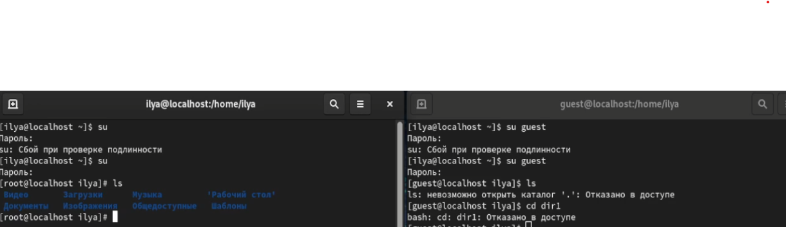{#fig:001 width=70%}

2. От имени пользователя guest определил расширенные атрибуты файла "file1"

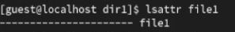{#fig:002 width=70%}

3. Установил права на файл "file1" разрешающие запись и чтение для владельца файла

{#fig:003 width=70%}

4. Попробовал установить на файл расширенный атрибут "a", получил отказ в доступе

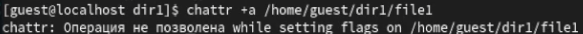{#fig:004 width=70%}

5. Установил на файл расширенный атрибут от имени суперпользователя

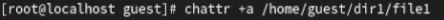{#fig:005 width=70%}

6. От пользователя guest проверил правильность установленных атрибутов

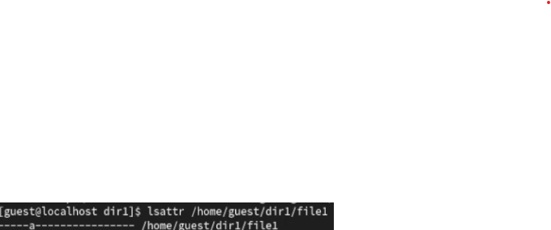{#fig:006 width=70%}

7. От имени пользователя guest попробовал выполнить запись, чтение, переименование и удаление файла "file1", получил отказ.

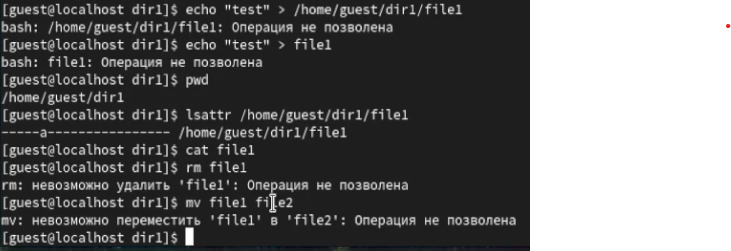{#fig:007 width=70%}

8. Попробовал поменять права файла на "000" от обоих пользователей, получил отказ

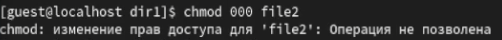{#fig:008 width=70%}

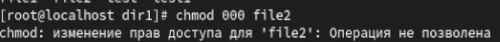{#fig:009 width=70%}

9. Снял расширенный атрибут "a" с файла, попробовал выполнить команды еще раз. Запись, чтение, переименование и удаление можно сделать. 

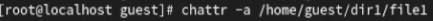{#fig:010 width=70%}

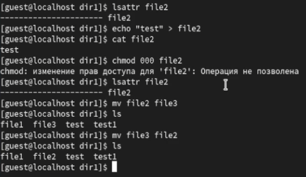{#fig:011 width=70%}

10. Попробовал поменять права на "000", получил отказ.

11. Повторил все действия с расширенным атрибутом "i". Запись, переименование и смена прав были запрещены, а чтение - разрешено.

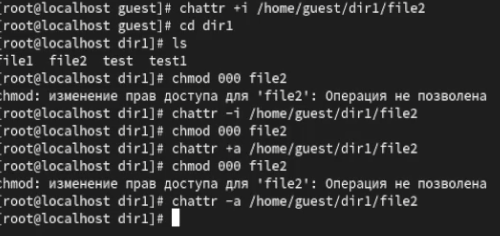{#fig:012 width=70%}

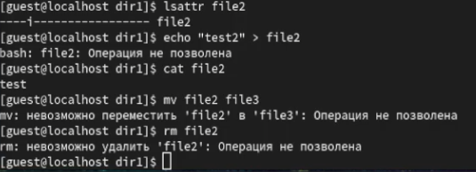{#fig:013 width=70%}

12. Составил таблицу прав действий с расширенными атрибутами "a" и "i".

 Расширенный атрибут | Создание | Удаление | Запись | Чтение| Переименование | Смена атрибутов файла |
 ------------------- | -------- | -------- | ------ | ----- | -------------- | --------------------- |
 --                  |+         | +        | +      | +     | +              | -                     |
 +a                  |-         | -        | -      | -     | -              | -                     |
 +i                  |-         | -        | -      | +     | -              | -                     |

# Выводы

Повысил свои навыки использование интерфейса командной строки, познакомился на примерах с тем, как используются основные и расширенные атрибуты
при разграничении доступа. Составил наглядные таблицы, поясняющие какие операции возможны при тех или иных установленных правах. Опрробовал 
действие на практике расширенных атрибутов "a" и "i".