---
## Front matter
title: "Информационная безопасность лабораторная работа №5"
subtitle: "Дискреционное разграничение прав в Linux. Исследование влияния дополнительных атрибутов"
author: "Ким Илья Владиславович НФИбд-01-21"

## Generic otions
lang: ru-RU
toc-title: "Содержание"

## Bibliography
bibliography: bib/cite.bib
csl: pandoc/csl/gost-r-7-0-5-2008-numeric.csl

## Pdf output format
toc: true # Table of contents
toc-depth: 2
fontsize: 12pt
linestretch: 1.5
papersize: a4
documentclass: scrreprt
## I18n polyglossia
polyglossia-lang:
  name: russian
  options:
	- spelling=modern
	- babelshorthands=true
polyglossia-otherlangs:
  name: english
## I18n babel
babel-lang: russian
babel-otherlangs: english
## Fonts
mainfont: IBM Plex Serif
romanfont: IBM Plex Serif
sansfont: IBM Plex Sans
monofont: IBM Plex Mono
mathfont: STIX Two Math
mainfontoptions: Ligatures=Common,Ligatures=TeX,Scale=0.94
romanfontoptions: Ligatures=Common,Ligatures=TeX,Scale=0.94
sansfontoptions: Ligatures=Common,Ligatures=TeX,Scale=MatchLowercase,Scale=0.94
monofontoptions: Scale=MatchLowercase,Scale=0.94,FakeStretch=0.9
mathfontoptions:
## Biblatex
biblatex: true
biblio-style: "gost-numeric"
biblatexoptions:
  - parentracker=true
  - backend=biber
  - hyperref=auto
  - language=auto
  - autolang=other*
  - citestyle=gost-numeric
## Pandoc-crossref LaTeX customization
figureTitle: "Рис."
## Misc options
indent: true
header-includes:
  - \usepackage{indentfirst}
  - \usepackage{float} # keep figures where there are in the text
  - \floatplacement{figure}{H} # keep figures where there are in the text
---

# Цель работы

Изучение механизмов изменения идентификаторов, применения
SetUID- и Sticky-битов. Получение практических навыков работы в консоли с дополнительными атрибутами. Рассмотрение работы механизма
смены идентификатора процессов пользователей, а также влияние бита
Sticky на запись и удаление файлов

# Выполнение лабораторной работы

## Создание программы

1. Создал программу simpleid.c (рис. [-@fig:001])

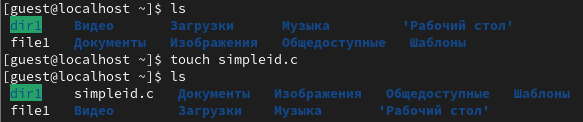{#fig:001 width=70%}

2. Записал код программы в simpleid.c (рис. [-@fig:002])

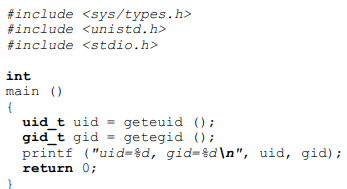{#fig:002 width=70%}

3. Скомпилировал и выполнил программу simpleid.c (рис. [-@fig:003])

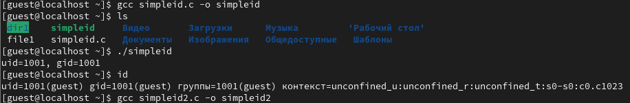{#fig:003 width=70%}

4. Изменил код программы в simpleid.c (рис. [-@fig:004])

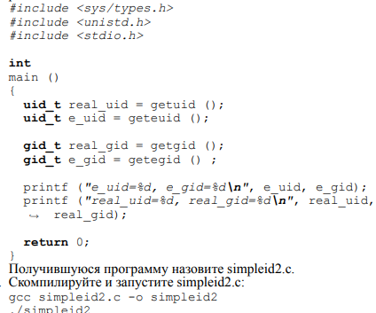{#fig:004 width=70%}

5. Скомпилировал и выполнил программу simpleid2.c (рис. [-@fig:005])

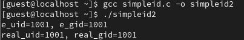{#fig:005 width=70%}

6. От имени суперпользователя поменял права на файл simpleid2.c, поменял владельца файла и выполнил программу (рис. [-@fig:006])

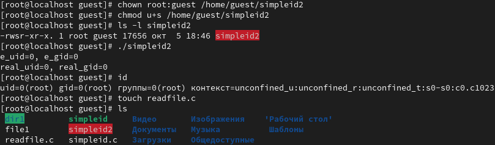{#fig:006 width=70%}

 - Результаты выполнения отличаются.

7. Создал файл readfile.c (рис. [-@fig:007])

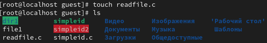{#fig:007 width=70%}
 
8. Записал код программы в readfile.c (рис. [-@fig:008])

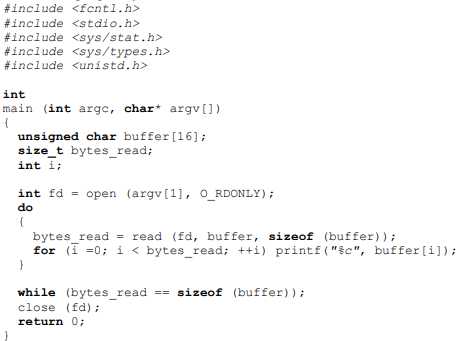{#fig:008 width=70%}

9. Скомпилировал readfile.c (рис. [-@fig:009])

{#fig:009 width=70%}

10. Сменил права и владельца readfile.c, попрбовал от имени пользователя guest прочитать файл, получил отказ (рис. [-@fig:010])

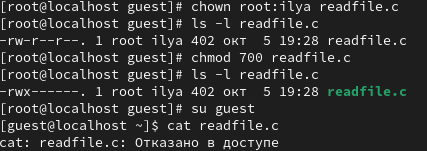{#fig:010 width=70%}

11. С помощью программы readfile прочитал файл /etc/shadow (рис. [-@fig:011])

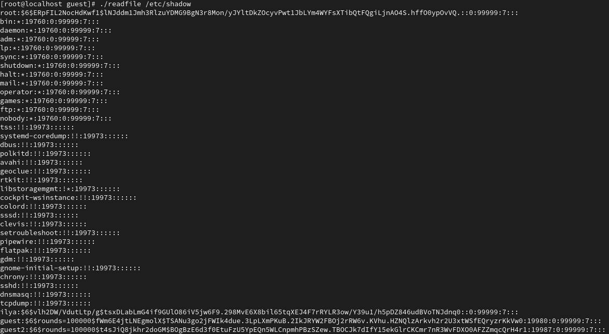{#fig:011 width=70%}

## Исследование Sticky-бита

1. Проверил установлен ли атрибут Sticky на директории /tmp , создал в ней файл file91.txt(рис. [-@fig:012])

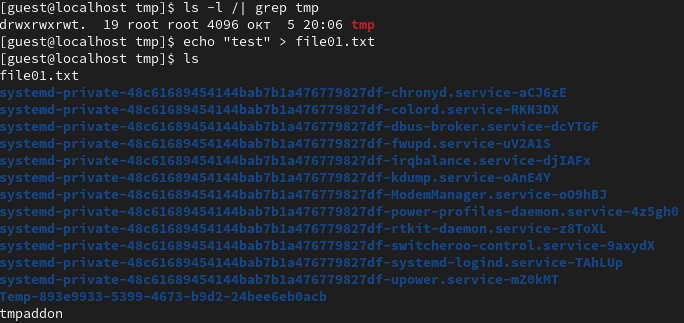{#fig:012 width=70%}

2. Проверил атрибуты у файла file01.txt , поменял атрибуты на чтение и запись для остальных пользователей (рис. [-@fig:013])

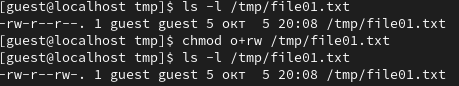{#fig:013 width=70%}

3. От пользователя guest 2 попробовал прочитать, изменить и удалить file01.txt, получилось только прочитать   (рис. [-@fig:014])

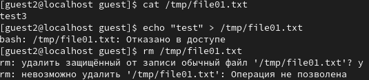{#fig:014 width=70%}

4. От имени суперпользователя снял атрибут t у /tmp (рис. [-@fig:015])

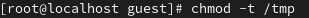{#fig:015 width=70%}

5. От имени guest 2 проверил, что у директории /tmp нет атрибута t. Попробовал сделать команды еще раз, ничего не поменялось. (рис. [-@fig:016])

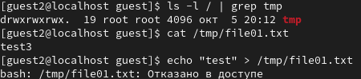{#fig:016 width=70%}

6. Поменял права файла file01.txt на 666 (рис. [-@fig:017])

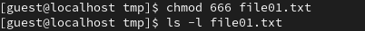{#fig:017 width=70%}

7. Попробовал выполнить команды еще раз, получилось сделать все, кроме удаления (рис. [-@fig:018])

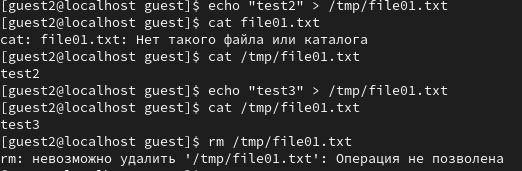{#fig:018 width=70%}

8. Удалил атрибут t и выполнил команды, получилось выполнить все, включая удаление (рис. [-@fig:019])

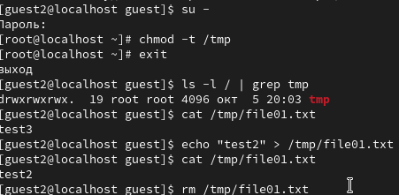{#fig:019 width=70%}

# Выводы

Изучил механизм изменения идентификаторов, применяя SetUID и Sticky-битов. Получил практические навыки работы в консоли с дополнительными атрибутами. Рассмотрел работу механизма смены идентификатора процессов пользователей, а также влияния бить Sticky на запись и удаление файлов.