---
## Front matter
title: "Информационная безопасность лабораторная работа №6"
subtitle: "Мандатное разграничение прав в Linux"
author: "Ким Илья Владиславович НФИбд-01-21"

## Generic otions
lang: ru-RU
toc-title: "Содержание"

## Bibliography
bibliography: bib/cite.bib
csl: pandoc/csl/gost-r-7-0-5-2008-numeric.csl

## Pdf output format
toc: true # Table of contents
toc-depth: 2
fontsize: 12pt
linestretch: 1.5
papersize: a4
documentclass: scrreprt
## I18n polyglossia
polyglossia-lang:
  name: russian
  options:
	- spelling=modern
	- babelshorthands=true
polyglossia-otherlangs:
  name: english
## I18n babel
babel-lang: russian
babel-otherlangs: english
## Fonts
mainfont: IBM Plex Serif
romanfont: IBM Plex Serif
sansfont: IBM Plex Sans
monofont: IBM Plex Mono
mathfont: STIX Two Math
mainfontoptions: Ligatures=Common,Ligatures=TeX,Scale=0.94
romanfontoptions: Ligatures=Common,Ligatures=TeX,Scale=0.94
sansfontoptions: Ligatures=Common,Ligatures=TeX,Scale=MatchLowercase,Scale=0.94
monofontoptions: Scale=MatchLowercase,Scale=0.94,FakeStretch=0.9
mathfontoptions:
## Biblatex
biblatex: true
biblio-style: "gost-numeric"
biblatexoptions:
  - parentracker=true
  - backend=biber
  - hyperref=auto
  - language=auto
  - autolang=other*
  - citestyle=gost-numeric
## Pandoc-crossref LaTeX customization
figureTitle: "Рис."
## Misc options
indent: true
header-includes:
  - \usepackage{indentfirst}
  - \usepackage{float} # keep figures where there are in the text
  - \floatplacement{figure}{H} # keep figures where there are in the text
---

# Цель работы

Развить навыки администрирования ОС Linux. Получить первое практическое знакомство с технологией SELinux1.
Проверить работу SELinx на практике совместно с веб-сервером Apache.

# Выполнение лабораторной работы

1. Установил httpd на CentOS (рис. [-@fig:001])

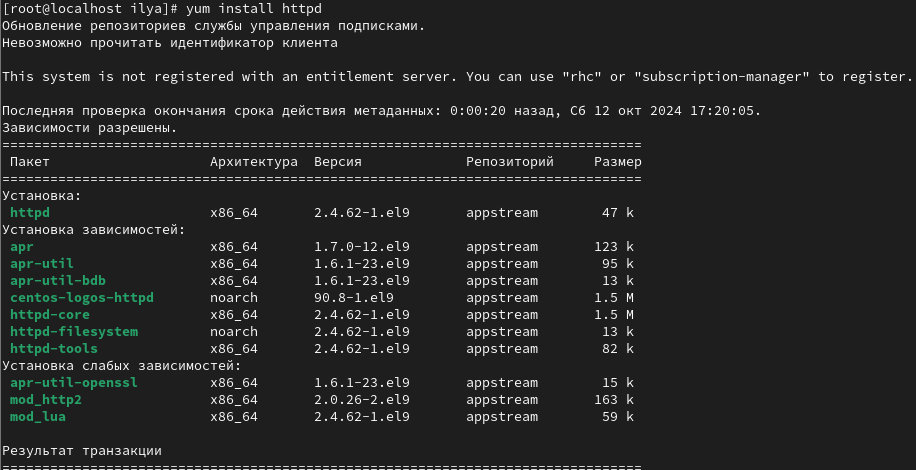{#fig:001 width=70%}

2. В конфигурационном файле httpd.conf задал параметр ServerName (рис. [-@fig:002])

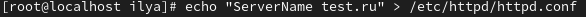{#fig:002 width=70%}

3. Добавил разрешающие правила (рис. [-@fig:003])

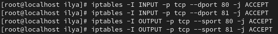{#fig:003 width=70%}

4. Проверил режим и политику работы системы (рис. [-@fig:004])

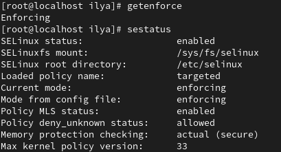{#fig:004 width=70%}

5. Запустил сервер apache (рис. [-@fig:005])

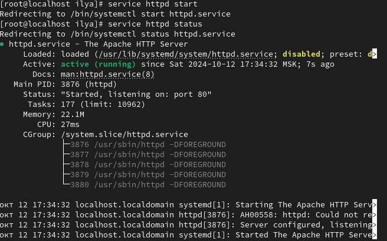{#fig:005 width=70%}

6. Определил контекст безопасности Apache (рис. [-@fig:006])

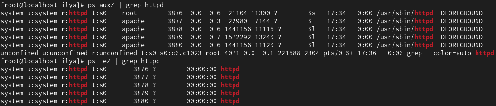{#fig:006 width=70%}

7. Посмотрел текущее состояние переключателей SELinux для Apache (рис. [-@fig:007])

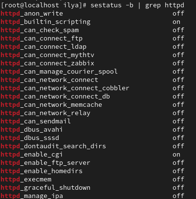{#fig:007 width=70%}

8. Установил пакет "settools-console"  (рис. [-@fig:008])

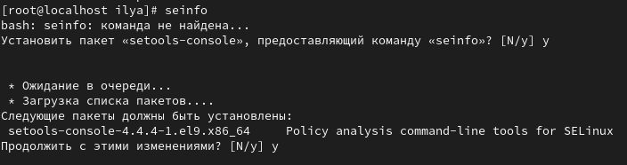{#fig:008 width=70%}

9. Посмотрел статистику по политике (рис. [-@fig:009])

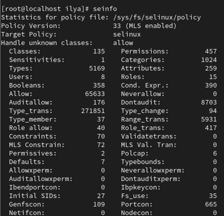{#fig:009 width=70%}

10. Посмотрел тип файлов и поддиректорий (рис. [-@fig:010])

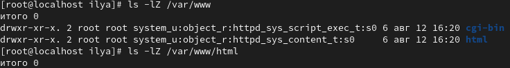{#fig:010 width=70%}

11. Создал html файл от имени суперпользователя (рис. [-@fig:011])

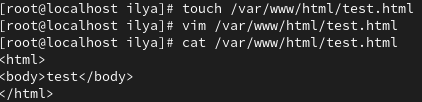{#fig:011 width=70%}

12. Проверил контекст созданного файла (рис. [-@fig:012])

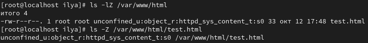{#fig:012 width=70%}

13. Открыл в браузере наш файл (рис. [-@fig:013])

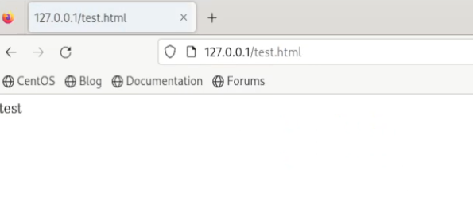{#fig:013 width=70%}

14. Изменил контекст файла test.html  (рис. [-@fig:014])

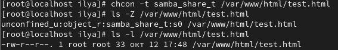{#fig:014 width=70%}

15. Попробовал открыть в браузере наш файл, получил ошибку(рис. [-@fig:015])

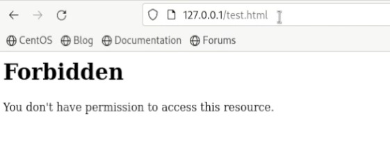{#fig:015 width=70%}

16. В файле httpd.conf изменил Listen с 80 на 81(рис. [-@fig:016])

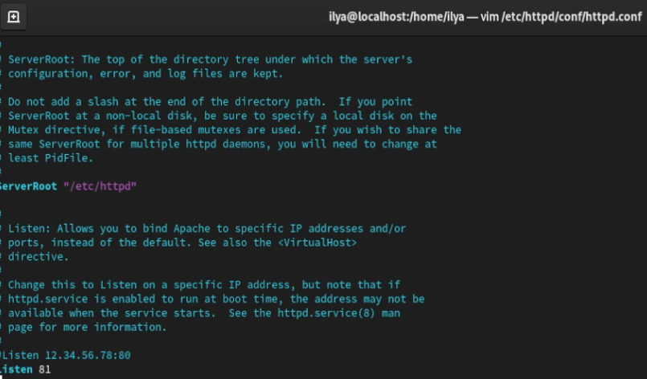{#fig:016 width=70%}

17. Сделал перезапуск Apache, произошел сбой (рис. [-@fig:017])

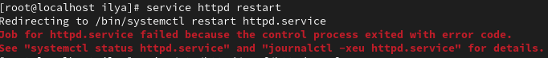{#fig:017 width=70%}

18. Добавил 81 порт в список (рис. [-@fig:018])

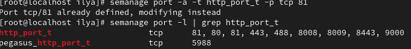{#fig:018 width=70%}

19. Добавил 81 порт в список, также изменил test.html (рис. [-@fig:019])

{#fig:019 width=70%}

20. Открыл файл в браузере (рис. [-@fig:020])

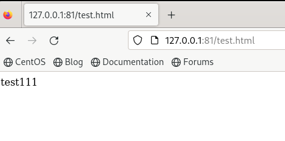{#fig:020 width=70%}

21. Вернул контекст файлу test.html (рис. [-@fig:021])

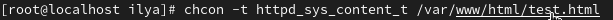{#fig:021 width=70%}

22. Вернул Listen 80 в файл html.config(рис. [-@fig:021])

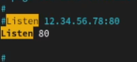{#fig:021 width=70%}

23. Удалил привязку к 81 порту (рис. [-@fig:022])

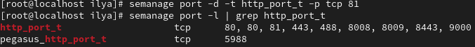{#fig:022 width=70%}

24. Удалил файл test.html (рис. [-@fig:023])

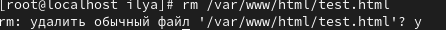{#fig:023 width=70%}

# Выводы

Развил навыки администрирования ОС Linux. Получил первое практическое знакомство с технологией SELinux. Проверил работу SELinux на практике совместно с веб-сервером Apache.