---
## Front matter
title: "Информационная безопасность лабораторная работа №7"
subtitle: "Элементы криптографии. Однократное гаммирование"
author: "Ким Илья Владиславович НФИбд-01-21"

## Generic otions
lang: ru-RU
toc-title: "Содержание"

## Bibliography
bibliography: bib/cite.bib
csl: pandoc/csl/gost-r-7-0-5-2008-numeric.csl

## Pdf output format
toc: true # Table of contents
toc-depth: 2
fontsize: 12pt
linestretch: 1.5
papersize: a4
documentclass: scrreprt
## I18n polyglossia
polyglossia-lang:
  name: russian
  options:
	- spelling=modern
	- babelshorthands=true
polyglossia-otherlangs:
  name: english
## I18n babel
babel-lang: russian
babel-otherlangs: english
## Fonts
mainfont: IBM Plex Serif
romanfont: IBM Plex Serif
sansfont: IBM Plex Sans
monofont: IBM Plex Mono
mathfont: STIX Two Math
mainfontoptions: Ligatures=Common,Ligatures=TeX,Scale=0.94
romanfontoptions: Ligatures=Common,Ligatures=TeX,Scale=0.94
sansfontoptions: Ligatures=Common,Ligatures=TeX,Scale=MatchLowercase,Scale=0.94
monofontoptions: Scale=MatchLowercase,Scale=0.94,FakeStretch=0.9
mathfontoptions:
## Biblatex
biblatex: true
biblio-style: "gost-numeric"
biblatexoptions:
  - parentracker=true
  - backend=biber
  - hyperref=auto
  - language=auto
  - autolang=other*
  - citestyle=gost-numeric
## Pandoc-crossref LaTeX customization
figureTitle: "Рис."
## Misc options
indent: true
header-includes:
  - \usepackage{indentfirst}
  - \usepackage{float} # keep figures where there are in the text
  - \floatplacement{figure}{H} # keep figures where there are in the text
---

# Цель работы

Освоить на практике применение режима однократного гаммирования

# Выполнение лабораторной работы

1. Подключил библиотеки и ввел сообщение "С Новым Годом, друзья!" (рис. [-@fig:001])

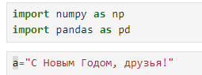{#fig:001 width=70%}

2. Перевод сообщения в шестнадцатеричную систему счисления (рис. [-@fig:002])(рис. [-@fig:003])

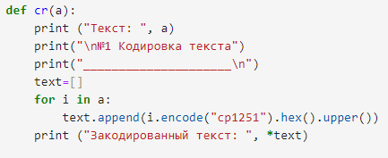{#fig:002 width=70%}

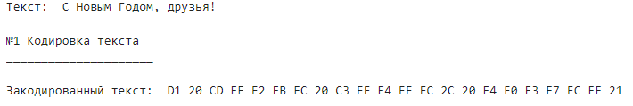{#fig:003 width=70%}

3. Создание ключа (рис. [-@fig:004])(рис. [-@fig:005])

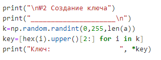{#fig:004 width=70%}

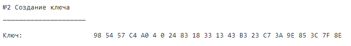{#fig:005 width=70%}

4. Кодировка текста ключем (рис. [-@fig:006])(рис. [-@fig:007])

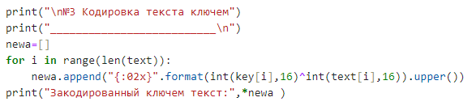{#fig:006 width=70%}

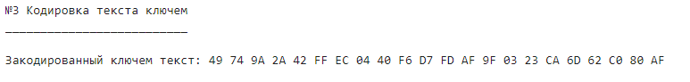{#fig:007 width=70%}

5. Создание нового ключа (рис. [-@fig:008])(рис. [-@fig:009])

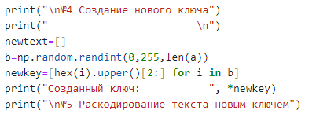{#fig:008 width=70%}

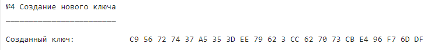{#fig:009 width=70%}

6. Раскодировка текста новым ключем (рис. [-@fig:010])(рис. [-@fig:011])

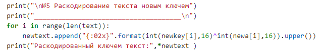{#fig:010 width=70%}

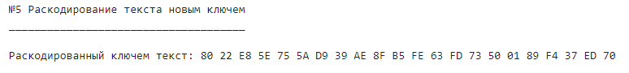{#fig:011 width=70%}

7. Полученный текст (рис. [-@fig:012]) (рис. [-@fig:013])

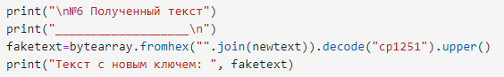{#fig:012 width=70%}

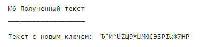{#fig:013 width=70%}

8. Поиск нужного ключа по исходному и закодированному тексту (рис. [-@fig:014])(рис. [-@fig:015])

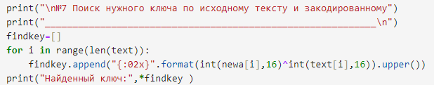{#fig:014 width=70%}

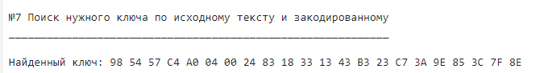{#fig:015 width=70%}

9. Расшифровка текста по найденному ключу (рис. [-@fig:016])(рис. [-@fig:017])

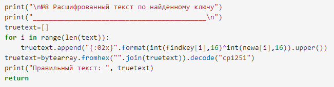{#fig:016 width=70%}

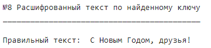{#fig:017 width=70%}

# Листинг

import numpy as np

import pandas as pd

a="С Новым Годом, друзья!"

def cr(a):
    print ("Текст: ", a)
	
    print("\n№1 Кодировка текста")
	
    print("_____________________\n")
    text=[]
    for i in a:
        text.append(i.encode("cp1251").hex().upper())
    print ("Закодированный текст: ", *text)
    
    print("\n№2 Создание ключа")
    print("_____________________\n")
    k=np.random.randint(0,255,len(a))
    key=[hex(i).upper()[2:] for i in k]
    print("Ключ:                 ", *key)
    
    print("\n№3 Кодировка текста ключем")
    print("__________________________\n")
    newa=[]
    for i in range(len(text)):
        newa.append("{:02x}".format(int(key[i],16)^int(text[i],16)).upper())
    print("Закодированный ключем текст:",*newa )
    
    print("\n№4 Создание нового ключа")
    print("________________________\n")
    newtext=[]
    b=np.random.randint(0,255,len(a))
    newkey=[hex(i).upper()[2:] for i in b]
    print("Созданный ключ:           ", *newkey)
    
    print("\n№5 Раскодирование текста новым ключем")
    print("_____________________________________\n")
    for i in range(len(text)):
        newtext.append("{:02x}".format(int(newkey[i],16)^int(newa[i],16)).upper())
    print("Раскодированный ключем текст:",*newtext )
    
    print("\n№6 Полученный текст")
    print("___________________\n")
    faketext=bytearray.fromhex("".join(newtext)).decode("cp1251").upper()
    print("Текст с новым ключем: ", faketext)
    
    print("\n№7 Поиск нужного ключа по исходному тексту и закодированному")
    print("____________________________________________________________\n")
    findkey=[]
    for i in range(len(text)):
        findkey.append("{:02x}".format(int(newa[i],16)^int(text[i],16)).upper())
    print("Найденный ключ:",*findkey )
    
    print("\n№8 Расшифрованный текст по найденному ключу")
    print("___________________________________________\n")
    truetext=[]
    for i in range(len(text)):
        truetext.append("{:02x}".format(int(findkey[i],16)^int(newa[i],16)).upper())
    truetext=bytearray.fromhex("".join(truetext)).decode("cp1251")
    print("Правильный текст: ", truetext)
    return 

# Выводы

Освоил на практике применение однократного гаммирования