---
## Front matter
title: "Информационная безопасность лабораторная работа №8"
subtitle: "Элементы криптографии. Шифрование (кодирование) различных исходных текстов одним ключом"
author: "Ким Илья Владиславович НФИбд-01-21"

## Generic otions
lang: ru-RU
toc-title: "Содержание"

## Bibliography
bibliography: bib/cite.bib
csl: pandoc/csl/gost-r-7-0-5-2008-numeric.csl

## Pdf output format
toc: true # Table of contents
toc-depth: 2
fontsize: 12pt
linestretch: 1.5
papersize: a4
documentclass: scrreprt
## I18n polyglossia
polyglossia-lang:
  name: russian
  options:
	- spelling=modern
	- babelshorthands=true
polyglossia-otherlangs:
  name: english
## I18n babel
babel-lang: russian
babel-otherlangs: english
## Fonts
mainfont: IBM Plex Serif
romanfont: IBM Plex Serif
sansfont: IBM Plex Sans
monofont: IBM Plex Mono
mathfont: STIX Two Math
mainfontoptions: Ligatures=Common,Ligatures=TeX,Scale=0.94
romanfontoptions: Ligatures=Common,Ligatures=TeX,Scale=0.94
sansfontoptions: Ligatures=Common,Ligatures=TeX,Scale=MatchLowercase,Scale=0.94
monofontoptions: Scale=MatchLowercase,Scale=0.94,FakeStretch=0.9
mathfontoptions:
## Biblatex
biblatex: true
biblio-style: "gost-numeric"
biblatexoptions:
  - parentracker=true
  - backend=biber
  - hyperref=auto
  - language=auto
  - autolang=other*
  - citestyle=gost-numeric
## Pandoc-crossref LaTeX customization
figureTitle: "Рис."
## Misc options
indent: true
header-includes:
  - \usepackage{indentfirst}
  - \usepackage{float} # keep figures where there are in the text
  - \floatplacement{figure}{H} # keep figures where there are in the text
---

# Цель работы

Освоить на практике применение режима однократного гаммирования на примере кодирования различных исходных текстов одним ключом

# Выполнение лабораторной работы

1. Подключил библиотеки и ввел сообщения (рис. [-@fig:001])

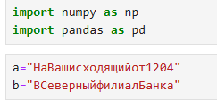{#fig:001 width=70%}

2. Перевод сообщений в шестнадцатеричную систему счисления (рис. [-@fig:002])(рис. [-@fig:003])

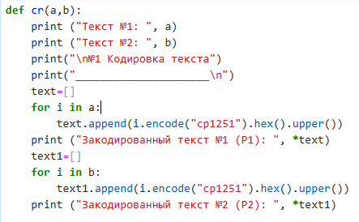{#fig:002 width=70%}

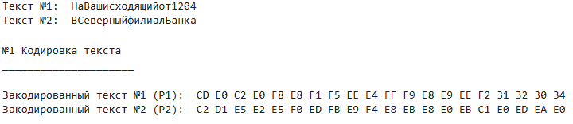{#fig:003 width=70%}

3. Создание ключа (рис. [-@fig:004])(рис. [-@fig:005])

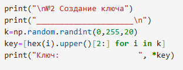{#fig:004 width=70%}

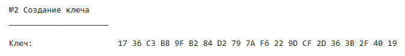{#fig:005 width=70%}

4. Кодировка текстов ключем (рис. [-@fig:006])(рис. [-@fig:007])

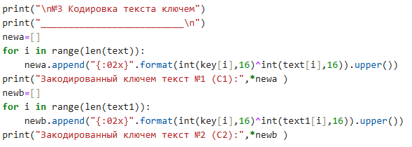{#fig:006 width=70%}

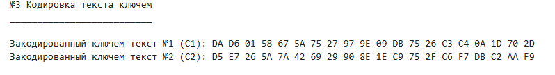{#fig:007 width=70%}

5. Расшифровка текстов по C1, C2, P1, P2 (рис. [-@fig:008])(рис. [-@fig:009])

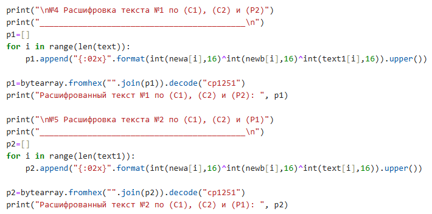{#fig:008 width=70%}

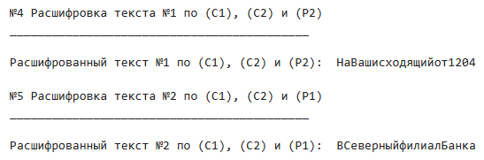{#fig:009 width=70%}

6. Расшифровка текстов по известному ключу (рис. [-@fig:010])(рис. [-@fig:011])

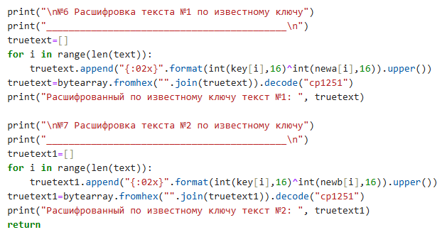{#fig:010 width=70%}

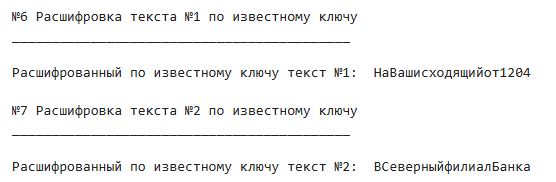{#fig:011 width=70%}

# Листинг

import numpy as np

import pandas as pd

a="НаВашисходящийот1204"

b="ВСеверныйфилиалБанка"

def cr(a,b):
    print ("Текст №1: ", a)
	
    print ("Текст №2: ", b)
	
    print("\n№1 Кодировка текста")
    print("_____________________\n")
    text=[]
    for i in a:
        text.append(i.encode("cp1251").hex().upper())
    print ("Закодированный текст №1 (P1): ", *text)
    text1=[]
    for i in b:
        text1.append(i.encode("cp1251").hex().upper())
    print ("Закодированный текст №2 (P2): ", *text1)
    
    print("\n№2 Создание ключа")
    print("_____________________\n")
    k=np.random.randint(0,255,20)
    key=[hex(i).upper()[2:] for i in k]
    print("Ключ:                 ", *key)
    
    print("\n№3 Кодировка текста ключем")
    print("__________________________\n")
    newa=[]
    for i in range(len(text)):
        newa.append("{:02x}".format(int(key[i],16)^int(text[i],16)).upper())
    print("Закодированный ключем текст №1 (С1):",*newa )
    newb=[]
    for i in range(len(text1)):
        newb.append("{:02x}".format(int(key[i],16)^int(text1[i],16)).upper())
    print("Закодированный ключем текст №2 (С2):",*newb )

    print("\n№4 Расшифровка текста №1 по (C1), (C2) и (P2)")
    print("___________________________________________\n")
    p1=[]
    for i in range(len(text)):
        p1.append("{:02x}".format(int(newa[i],16)^int(newb[i],16)^int(text1[i],16)).upper())
    
    p1=bytearray.fromhex("".join(p1)).decode("cp1251")
    print("Расшифрованный текст №1 по (C1), (C2) и (P2): ", p1)

    print("\n№5 Расшифровка текста №2 по (C1), (C2) и (P1)")
    print("___________________________________________\n")
    p2=[]
    for i in range(len(text1)):
        p2.append("{:02x}".format(int(newa[i],16)^int(newb[i],16)^int(text[i],16)).upper())
    
    p2=bytearray.fromhex("".join(p2)).decode("cp1251")
    print("Расшифрованный текст №2 по (C1), (C2) и (P1): ", p2)

    print("\n№6 Расшифровка текста №1 по известному ключу")
    print("___________________________________________\n")
    truetext=[]
    for i in range(len(text)):
        truetext.append("{:02x}".format(int(key[i],16)^int(newa[i],16)).upper())
    truetext=bytearray.fromhex("".join(truetext)).decode("cp1251")
    print("Расшифрованный по известному ключу текст №1: ", truetext)

    print("\n№7 Расшифровка текста №2 по известному ключу")
    print("___________________________________________\n")
    truetext1=[]
    for i in range(len(text)):
        truetext1.append("{:02x}".format(int(key[i],16)^int(newb[i],16)).upper())
    truetext1=bytearray.fromhex("".join(truetext1)).decode("cp1251")
    print("Расшифрованный по известному ключу текст №2: ", truetext1)
    return 
 
# Выводы

Освоил на практике применение режима однократного гаммирования на примере кодирования различных исходных текстов одним ключом