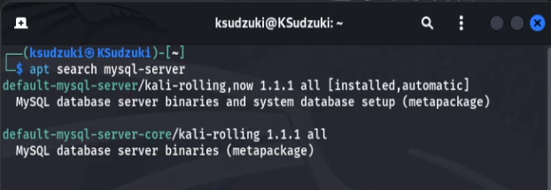
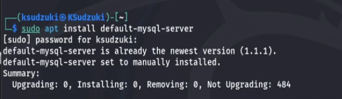
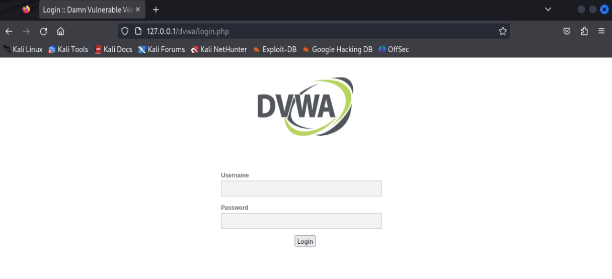
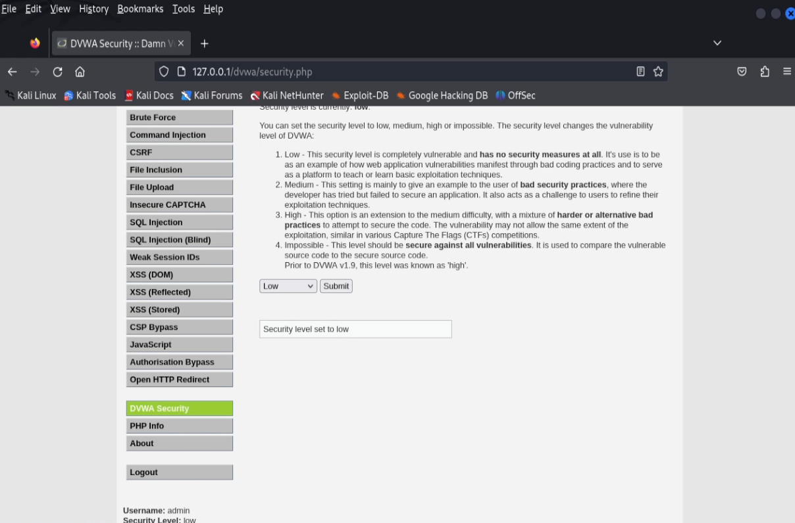

---
## Front matter
title: "Индивидуальный проект этап 2"
subtitle: "Информационная безопасность"
author: "Ким Илья Владиславович НФИбд-01-21"

## Generic otions
lang: ru-RU
toc-title: "Содержание"

## Bibliography
bibliography: bib/cite.bib
csl: pandoc/csl/gost-r-7-0-5-2008-numeric.csl

## Pdf output format
toc: true # Table of contents
toc-depth: 2
lof: true # List of figures
lot: true # List of tables
fontsize: 12pt
linestretch: 1.5
papersize: a4
documentclass: scrreprt
## I18n polyglossia
polyglossia-lang:
  name: russian
  options:
	- spelling=modern
	- babelshorthands=true
polyglossia-otherlangs:
  name: english
## I18n babel
babel-lang: russian
babel-otherlangs: english
## Fonts
mainfont: IBM Plex Serif
romanfont: IBM Plex Serif
sansfont: IBM Plex Sans
monofont: IBM Plex Mono
mathfont: STIX Two Math
mainfontoptions: Ligatures=Common,Ligatures=TeX,Scale=0.94
romanfontoptions: Ligatures=Common,Ligatures=TeX,Scale=0.94
sansfontoptions: Ligatures=Common,Ligatures=TeX,Scale=MatchLowercase,Scale=0.94
monofontoptions: Scale=MatchLowercase,Scale=0.94,FakeStretch=0.9
mathfontoptions:
## Biblatex
biblatex: true
biblio-style: "gost-numeric"
biblatexoptions:
  - parentracker=true
  - backend=biber
  - hyperref=auto
  - language=auto
  - autolang=other*
  - citestyle=gost-numeric
## Pandoc-crossref LaTeX customization
figureTitle: "Рис."
tableTitle: "Таблица"
listingTitle: "Листинг"
lofTitle: "Список иллюстраций"
lotTitle: "Список таблиц"
lolTitle: "Листинги"
## Misc options
indent: true
header-includes:
  - \usepackage{indentfirst}
  - \usepackage{float} # keep figures where there are in the text
  - \floatplacement{figure}{H} # keep figures where there are in the text
---

# Цель работы

- Научиться основным способам тестирования веб приложений

- Установить и настроить DVWA на Kali linux

# Выполнение лабораторной работы

1. Клонировал DVWA с https://github.com/digininja/DVWA

2. Переименовал директорию DVWA на dvwa

3. Задал права пользователя для директории

4. Зашел в директорию dvwa/config

5. Проверил что в ней есть 

6. Открыл файл config.inc.php

7. Файл config.inc.php

8. Заменил в нем db_user и db_password на user и pass

9. Посмотрел мой mysql-server

10. Установил mysql-server 

11. Запустил mysql

12. Посмотрел статус mysql

13. Зашел в mysql

14. Создал пользователя и дал ему все права

15. Зашёл в папку /etc/php/8.2/apache2

16. Посмотрел что в ней есть и открыл файл php.ini

17. Файл php.ini

18. Нашел в нем allow_url_fopen и allow_url_include и поменял на "On"

19. Запустил apache2 и проверил его статус

20. Зашёл на Localhost 127.0.0.1/dvwa/setup.php

21. Ввёл логин и пароль admin password

22. Поменял защиту на low

# Выводы

- Установил и настроил DVWA на Kali linux