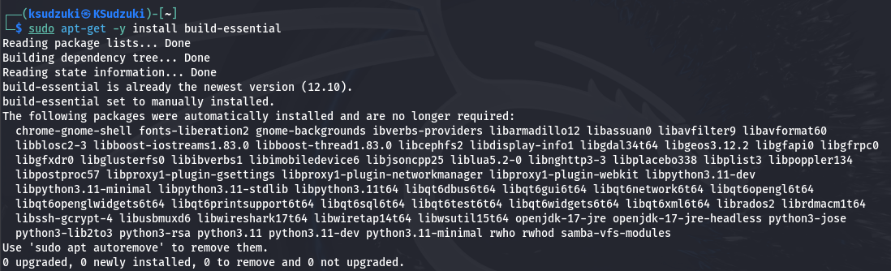
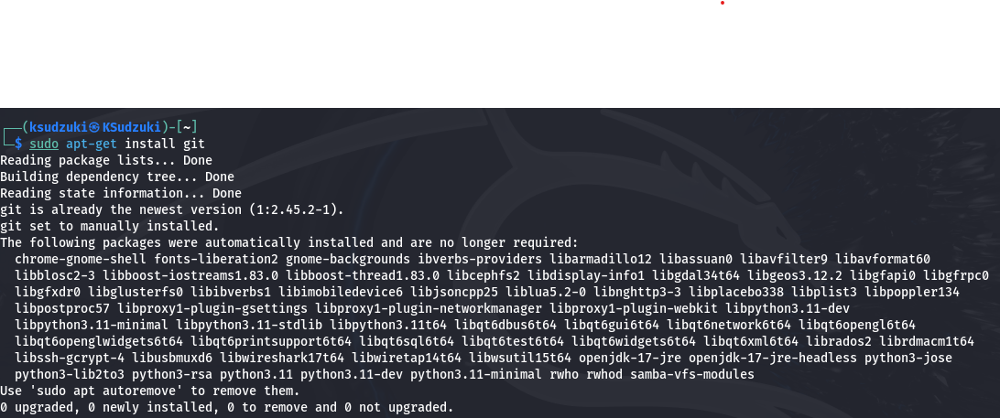
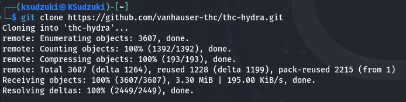
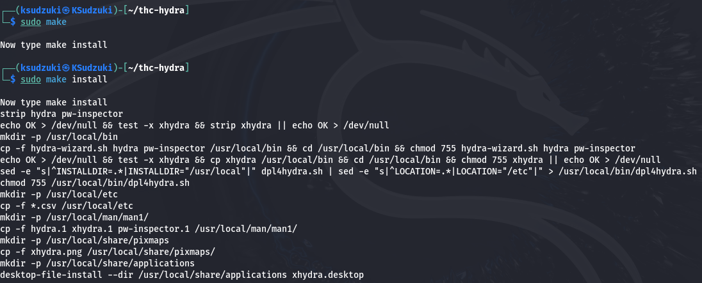
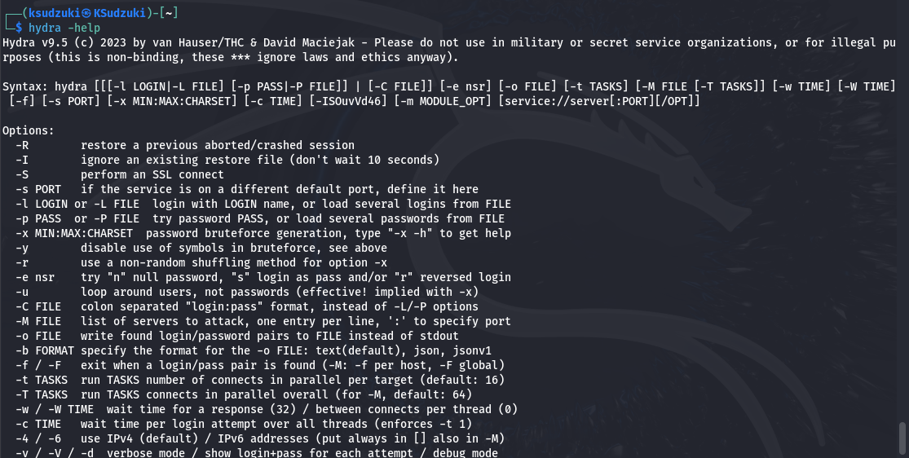

---
## Front matter
lang: ru-RU
title: Индивидуальный проект этап 3
subtitle: Информационная безопасность
author:
  - Ким И. В. НФИбд-01-21
institute:
  - Российский университет дружбы народов, Москва, Россия

## i18n babel
babel-lang: russian
babel-otherlangs: english

## Formatting pdf
toc: false
toc-title: Содержание
slide_level: 2
aspectratio: 169
section-titles: true
theme: metropolis
header-includes:
 - \metroset{progressbar=frametitle,sectionpage=progressbar,numbering=fraction}
---

# Цели и задачи

Установить hydra на kali linux

# Выполнение работы

## Установил последние обновления системы sudo командой - apt-get update && sudo apt-get upgrade && sudo apt-get dist-upgrade

{#fig:001 width=70%}

## После обновления системы установил важные компоненты, необходимые для hydra

{#fig:002 width=70%}

## После обновления системы установил важные компоненты, необходимые для hydra

{#fig:003 width=70%}

## После обновления системы установил важные компоненты, необходимые для hydra

{#fig:004 width=70%}

## Клонировал репозиторий с Github

{#fig:005 width=70%}

## Зашёл в директорию thc-hydra и выполнил команду - ./configure

{#fig:006 width=70%}

## Выполнил команду с помощью sudo make и sudo make install

{#fig:007 width=70%}

## Проверил установилась ли hydra с помощью команды - hydra -help

{#fig:008 width=70%}

## Выводы

Установил hydra на kali linux 