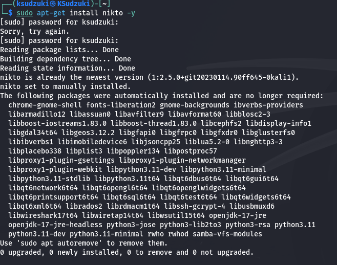
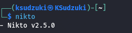
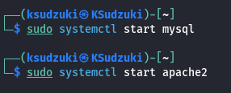
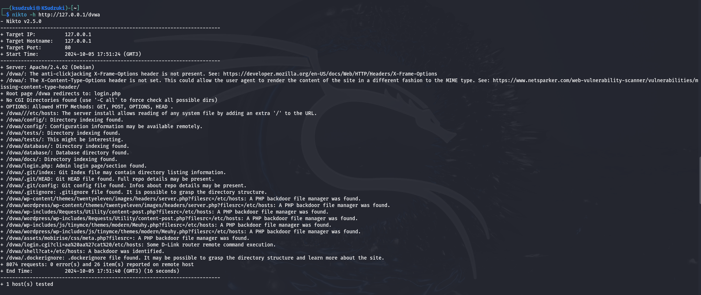
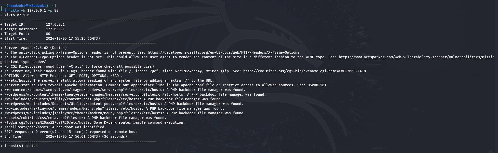

---
## Front matter
lang: ru-RU
title: Индивидуальный проект этап 4
subtitle: Информационная безопасность
author:
  - Ким И. В. НФИбд-01-21
institute:
  - Российский университет дружбы народов, Москва, Россия

## i18n babel
babel-lang: russian
babel-otherlangs: english

## Formatting pdf
toc: false
toc-title: Содержание
slide_level: 2
aspectratio: 169
section-titles: true
theme: metropolis
header-includes:
 - \metroset{progressbar=frametitle,sectionpage=progressbar,numbering=fraction}
---

# Цели и задачи

Установить nikto и просканировать локальный веб-сервер

# Выполнение работы

## Установил nikto на kali linux 

{#fig:001 width=70%}

## Проверил установилась ли nikto и её версию

{#fig:002 width=70%}

## Запустил локальный веб-сервер (рис. [-@fig:003])

{#fig:003 width=70%}

## Просканировал веб-сервер по полному URL 

{#fig:004 width=70%}

## Просканировал веб-сервер по порту и ip-адресу 

{#fig:005 width=70%}

## Выводы

Установил nikto на kali linux.
Просканировал локальный веб-сервер с помощью nikto двумя способами.
При сканировании по полному URL, дается больше информации.