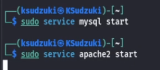
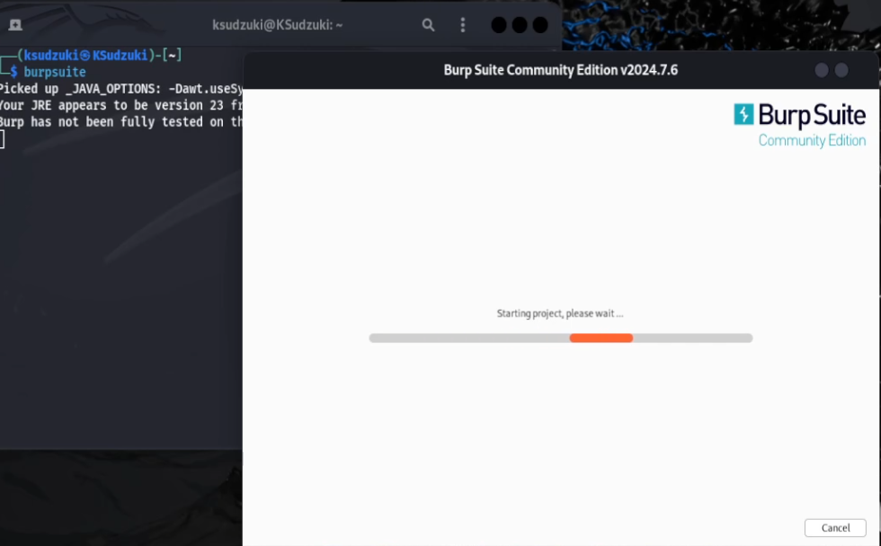
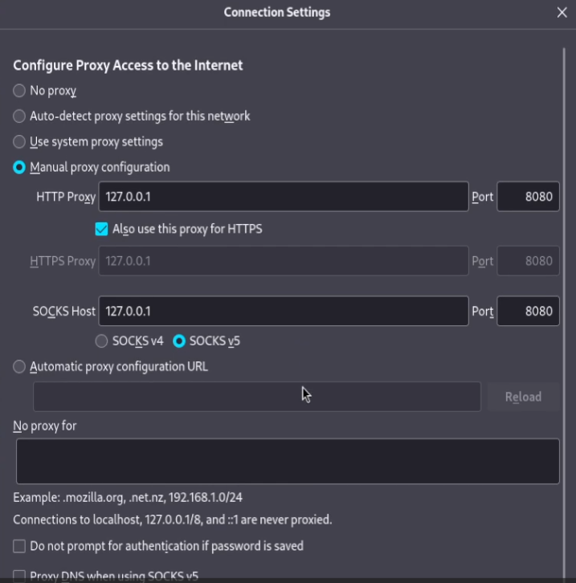
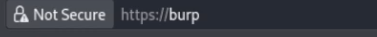
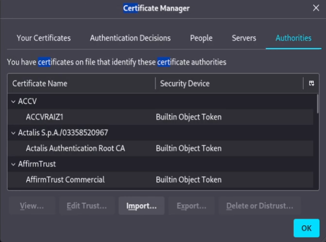
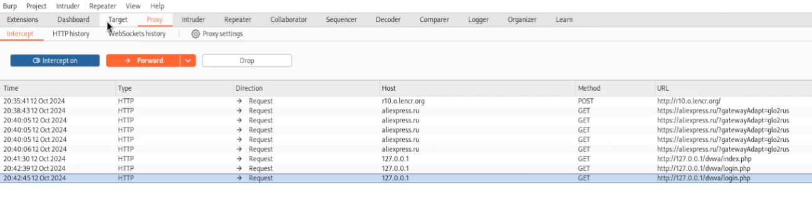
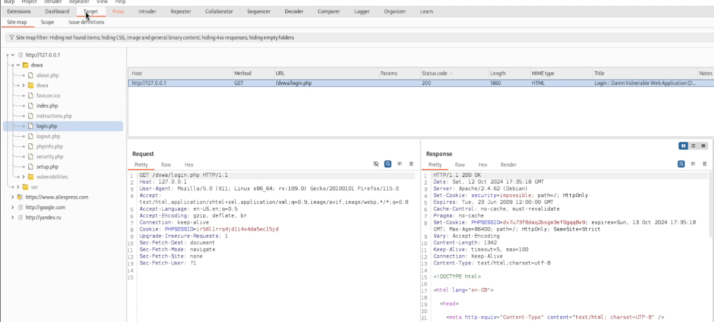
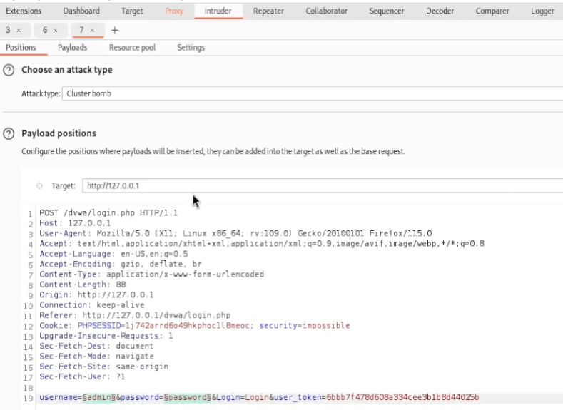
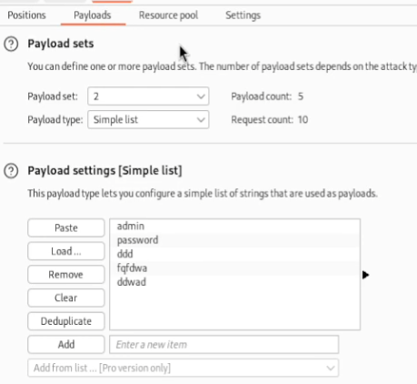
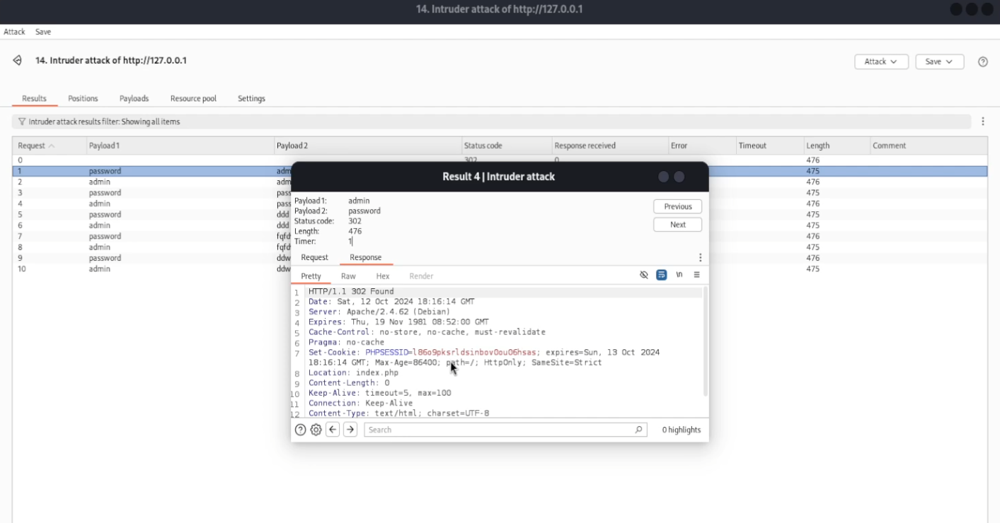

---
## Front matter
lang: ru-RU
title: Индивидуальный проект этап 5
subtitle: Информационная безопасность
author:
  - Ким И. В. НФИбд-01-21
institute:
  - Российский университет дружбы народов, Москва, Россия

## i18n babel
babel-lang: russian
babel-otherlangs: english

## Formatting pdf
toc: false
toc-title: Содержание
slide_level: 2
aspectratio: 169
section-titles: true
theme: metropolis
header-includes:
 - \metroset{progressbar=frametitle,sectionpage=progressbar,numbering=fraction}
---

# Цели и задачи

Научиться пользоваться Burp Suite

# Выполнение работы

## Запустил локальный веб-сервер 

{#fig:001 width=70%}

## Запустил Burp Suite

{#fig:002 width=70%}

## Настроил прокси в браузере

{#fig:003 width=70%}

## Зашёл на сайт burp и скачал сертификаты 

{#fig:004 width=70%}

## Установил сертификаты в браузер 

{#fig:005 width=70%}

## Перезапустил BurpSuite и зашёл на наш сайт dvwa/login.php

{#fig:006 width=70%}

## Во вкладке Proxy отображаются запросы на вход 

{#fig:007 width=70%}

## Во вкладке target мы можем посмотреть данные о цели 

{#fig:008 width=70%}

## От туда мы можем отправить сайт во вкладку Intuder 

{#fig:009 width=70%}

## Здесь мы можем заполнить данные, которые будут посылаться на сайт, и произвести атаку 

{#fig:010 width=70%}

## Произведя атаку, мы можем посмотреть данные, в которых можно увидеть где мы оказываемся. При комбинации admin и password, мы оказываемся на index.php, что означает успешные переход на другую страницу - вход 

{#fig:011 width=70%}

## Выводы

Попробовали применить инструменты Burp Suite на практике, использовали наш локальный веб-сервер для проверки атаки и исследовали полученные данные.