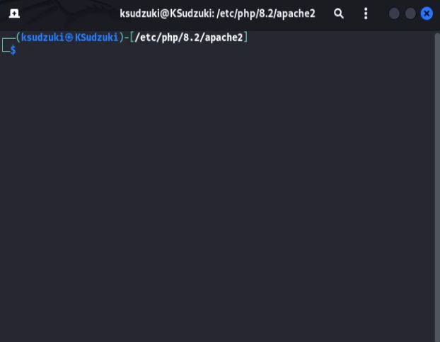
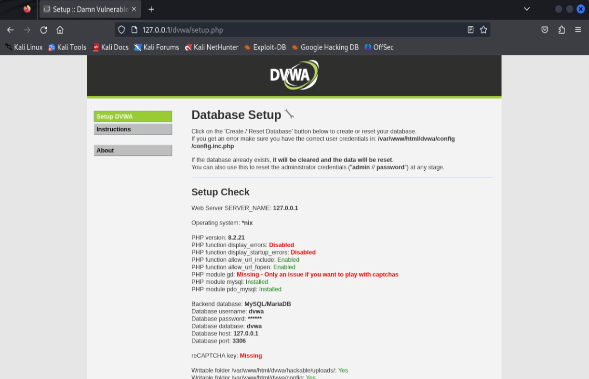

---
## Front matter
lang: ru-RU
title: Индивидуальный проект этап 2
subtitle: Информационная безопасность
author:
  - Ким И. В. НФИбд-01-21
institute:
  - Российский университет дружбы народов, Москва, Россия

## i18n babel
babel-lang: russian
babel-otherlangs: english

## Formatting pdf
toc: false
toc-title: Содержание
slide_level: 2
aspectratio: 169
section-titles: true
theme: metropolis
header-includes:
 - \metroset{progressbar=frametitle,sectionpage=progressbar,numbering=fraction}
---

## Цели и задачи

- Научиться основным способам тестирования веб приложений

- Установить и настроить DVWA на Kali linux

## Выполнение работы

1. Клонировал DVWA с https://github.com/digininja/DVWA 

## Выполнение работы

2. Переименовал директорию DVWA на dvwa

## Выполнение работы

3. Задал права пользователя для директории

## Выполнение работы

4. Зашел в директорию dvwa/config

## Выполнение работы

5. Проверил что в ней есть 

## Выполнение работы

6. Открыл файл config.inc.php

## Выполнение работы

7. Файл config.inc.php

## Выполнение работы

8. Заменил в нем db_user и db_password на user и pass

## Выполнение работы

9. Посмотрел мой mysql-server

## Выполнение работы

10. Установил mysql-server 

## Выполнение работы

11. Запустил mysql

## Выполнение работы

12. Посмотрел статус mysql

## Выполнение работы

13. Зашел в mysql

## Выполнение работы

14. Создал пользователя и дал ему все права

## Выполнение работы

15. Зашёл в папку /etc/php/8.2/apache2

## Выполнение работы

16. Посмотрел что в ней есть и открыл файл php.ini

## Выполнение работы

17. Файл php.ini

## Выполнение работы

18. Нашел в нем allow_url_fopen и allow_url_include и поменял на "On"

## Выполнение работы

19. Запустил apache2 и проверил его статус

## Выполнение работы

20. Зашёл на Localhost 127.0.0.1/dvwa/setup.php

## Выполнение работы

21. Ввёл логин и пароль admin password

## Выполнение работы

22. Поменял защиту на low

## Выводы

- Установил и настроил DVWA на Kali linux